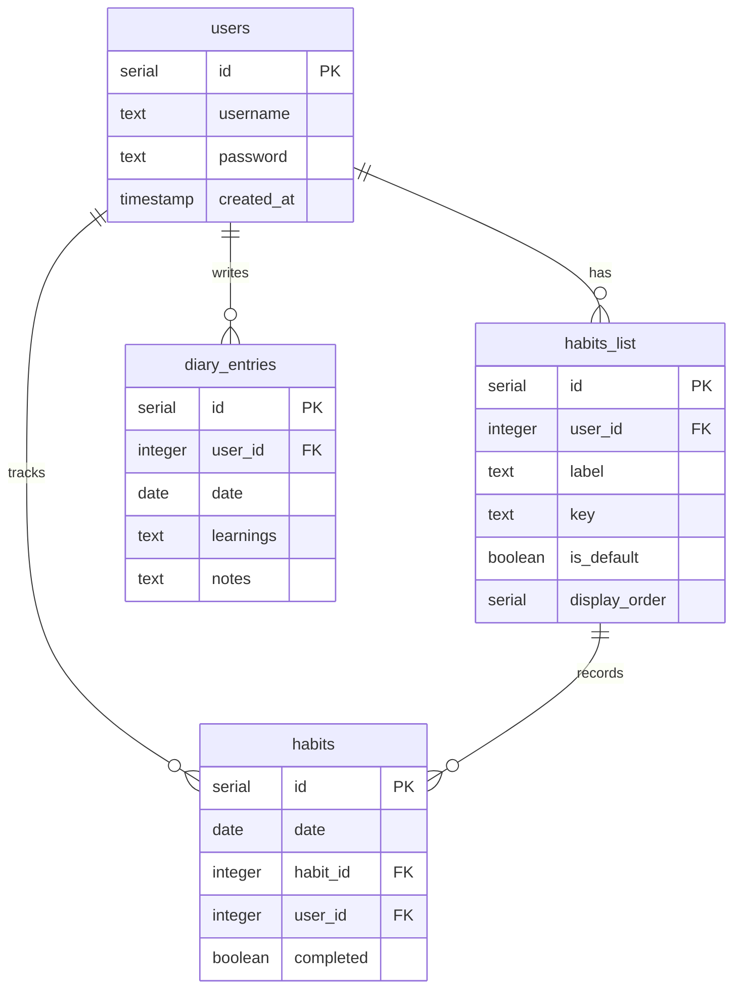

# データベース ER図

## テーブル詳細

### users (ユーザー)

- id: プライマリーキー
- username: ユーザー名（一意）
- password: ハッシュ化されたパスワード
- created_at: アカウント作成日時

### habits_list (習慣リスト)

- id: プライマリーキー
- user_id: ユーザーID（外部キー）
- label: 習慣の名前
- key: システム内部での識別子
- is_default: デフォルト習慣かどうか
- display_order: 表示順序

### habits (習慣記録)

- id: プライマリーキー
- date: 実行日
- habit_id: 習慣ID（外部キー）
- user_id: ユーザーID（外部キー）
- completed: 完了状態

### diary_entries (日報)

- id: プライマリーキー
- user_id: ユーザーID（外部キー）
- date: 記録日
- learnings: 学んだこと
- notes: メモ・ノート

## リレーションシップ

1. ユーザー(users) → 習慣リスト(habits_list): 1対多
   - ユーザーは複数の習慣を持つことができる
2. ユーザー(users) → 習慣記録(habits): 1対多
   - ユーザーは複数の習慣記録を持つ
3. ユーザー(users) → 日報(diary_entries): 1対多
   - ユーザーは複数の日報を書くことができる
4. 習慣リスト(habits_list) → 習慣記録(habits): 1対多
   - 1つの習慣に対して複数の実行記録がある
