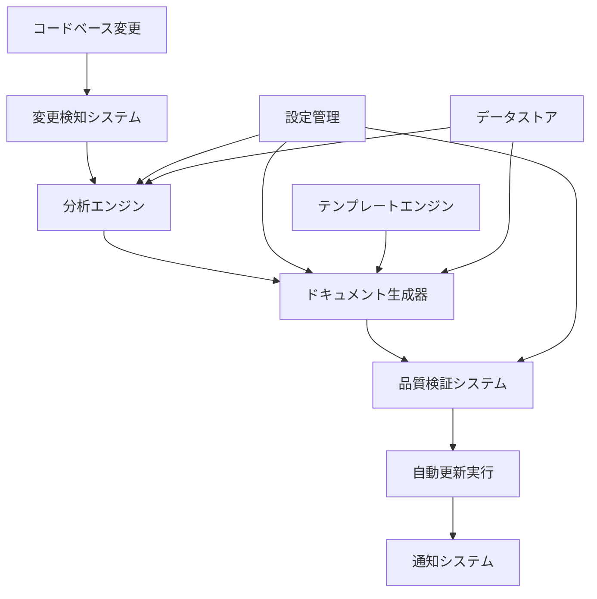

# ドキュメント自動更新システム設計書

*作成日: 2025年8月23日*  
*対象: Next.jsボイラープレートプロジェクト*  
*優先度: 中期実装（3-6ヶ月）*

## 🎯 システム概要

### 目的
プロジェクトの成長に伴い増加するドキュメントの整合性維持と更新作業の自動化により、開発効率の向上とドキュメント品質の持続的改善を実現する。

### 背景
- 手動ドキュメント更新による整合性不備の発生
- 技術スタック変更時の複数箇所更新漏れ
- 実装状況とドキュメントの乖離
- 開発レポート作成の工数増加

### 効果予測
- ドキュメント更新作業時間: **80%削減**
- 整合性エラー発生率: **90%削減**  
- 新機能実装時のドキュメント更新漏れ: **95%削減**

## 🏗️ システムアーキテクチャ

### 全体構成図



### コンポーネント設計

#### 1. 変更検知システム（Change Detection System）

**責務**: コードベースの変更を検知し、ドキュメント更新の必要性を判断

```typescript
interface ChangeDetectionConfig {
  watchPatterns: {
    packageJson: "package.json";           // 技術スタック変更
    components: "src/components/**/*.tsx"; // UIコンポーネント変更
    services: "src/app/(site)/services/**"; // サービスページ変更
    features: "src/app/**";                // 新機能実装
    tests: "**/*.test.{ts,tsx}";          // テスト実装状況
  };
  
  triggerConditions: {
    fileAdded: boolean;
    fileModified: boolean; 
    fileRenamed: boolean;
    dependencyUpdated: boolean;
  };
}

class ChangeDetectionSystem {
  async detectChanges(commitRange: string): Promise<ChangeEvent[]> {
    // Git diff解析による変更検知
    // ファイル種別による影響度分析
    // ドキュメント更新必要性の判定
  }
}
```

#### 2. 分析エンジン（Analysis Engine）

**責務**: 検知された変更を分析し、必要なドキュメント更新内容を特定

```typescript
interface AnalysisResult {
  changeType: 'feature' | 'bugfix' | 'refactor' | 'dependency' | 'config';
  affectedDocuments: DocumentTarget[];
  updatePriority: 'critical' | 'high' | 'medium' | 'low';
  suggestedActions: UpdateAction[];
}

class AnalysisEngine {
  // 実装済み機能リストの自動更新
  async analyzeFeatureImplementation(changes: ChangeEvent[]): Promise<FeatureAnalysis> {
    // 新しいページ・コンポーネント検出
    // 機能完成度の判定
    // 実装済みリストへの追加提案
  }
  
  // 技術スタック情報の自動同期
  async analyzeTechStackChanges(packageJson: PackageData): Promise<TechStackAnalysis> {
    // 依存関係バージョン変更検出
    // READMEバッジ更新内容生成
    // 技術仕様書更新内容生成  
  }
}
```

#### 3. ドキュメント生成器（Document Generator）

**責務**: 分析結果に基づいてドキュメントの更新内容を生成

```typescript
interface DocumentTemplate {
  type: 'feature-list' | 'tech-stack' | 'api-spec' | 'dev-report';
  template: string;
  dataBindings: Record<string, any>;
  validationRules: ValidationRule[];
}

class DocumentGenerator {
  // 実装済み機能リストの自動生成
  async generateFeatureList(features: FeatureData[]): Promise<string> {
    // テンプレート適用
    // 機能カテゴリ別分類
    // 優先度・ステータス情報付与
  }
  
  // 開発レポートの自動生成
  async generateDevReport(period: DateRange): Promise<DevReport> {
    // Git履歴分析
    // コミット統計生成
    // 主要成果サマリー作成
  }
  
  // API仕様書の自動生成
  async generateApiSpec(routes: ApiRoute[]): Promise<ApiDocumentation> {
    // ルートファイル解析
    // TypeScript型情報抽出
    // OpenAPI仕様書生成
  }
}
```

#### 4. 品質検証システム（Quality Verification System）

**責務**: 生成されたドキュメントの品質を検証

```typescript
interface QualityCheck {
  rule: string;
  severity: 'error' | 'warning' | 'info';
  message: string;
  suggestion?: string;
}

class QualityVerificationSystem {
  async verifyConsistency(docs: GeneratedDocument[]): Promise<QualityReport> {
    // ドキュメント間の整合性確認
    // バージョン情報の一致確認
    // リンク切れ検証
    // マークダウン構文チェック
  }
  
  async verifyAccuracy(doc: GeneratedDocument, source: any): Promise<QualityCheck[]> {
    // 実装内容との一致確認
    // 最新情報の反映確認
    // 古い情報の削除提案
  }
}
```

## 📋 自動更新対象ドキュメント

### 1. 実装状況管理ドキュメント

| ドキュメント | 更新トリガー | 自動化レベル | 更新頻度 |
|--------------|--------------|--------------|----------|
| **実装済み機能リスト** | 新機能完成 | 🟢 完全自動 | リアルタイム |
| **未実装機能リスト** | 機能実装完了 | 🟡 半自動 | 週次 |
| **UIコンポーネント一覧** | コンポーネント追加 | 🟢 完全自動 | リアルタイム |
| **開発進捗レポート** | 月末・四半期末 | 🟡 半自動 | 定期 |

### 2. 技術仕様ドキュメント

| ドキュメント | 更新トリガー | 自動化レベル | 更新頻度 |
|--------------|--------------|--------------|----------|
| **技術スタック情報** | package.json更新 | 🟢 完全自動 | リアルタイム |
| **API仕様書** | APIルート変更 | 🟡 半自動 | デプロイ時 |
| **データベース設計書** | スキーマ変更 | 🔴 手動 | 必要時 |
| **アーキテクチャ図** | 構造変更 | 🔴 手動 | 四半期 |

### 3. 運用・保守ドキュメント

| ドキュメント | 更新トリガー | 自動化レベル | 更新頻度 |
|--------------|--------------|--------------|----------|
| **パフォーマンスメトリクス** | 測定実行 | 🟢 完全自動 | 日次 |
| **エラーログ分析** | エラー発生 | 🟡 半自動 | 週次 |
| **セキュリティ監査結果** | 監査実行 | 🟡 半自動 | 月次 |
| **依存関係脆弱性レポート** | 脆弱性検出 | 🟢 完全自動 | 日次 |

## ⚙️ 実装技術スタック

### コア技術

```typescript
interface TechStack {
  runtime: "Node.js 18+";
  language: "TypeScript 5.x";
  buildTool: "Vite" | "esbuild";
  
  // Git操作
  gitLibrary: "simple-git" | "isomorphic-git";
  
  // ファイル処理
  fileSystem: "fs/promises";
  markdownParser: "unified" | "marked";
  yamlProcessor: "js-yaml";
  
  // テンプレート
  templateEngine: "handlebars" | "mustache";
  
  // 品質検証
  linter: "markdownlint";
  linkChecker: "markdown-link-check";
}
```

### 外部連携

```typescript
interface ExternalIntegrations {
  // GitHub統合
  github: {
    api: "@octokit/rest";
    webhooks: "github-webhook-handler";
  };
  
  // 通知システム
  notifications: {
    slack: "@slack/web-api";
    discord: "discord.js";
    email: "nodemailer";
  };
  
  // 監視・分析
  monitoring: {
    performance: "lighthouse-ci";
    dependencies: "@snyk/cli";
    bundle: "@next/bundle-analyzer";
  };
}
```

## 🔄 実装フェーズ

### Phase 1: 基盤構築（1ヶ月）

#### 優先度: 🔴 高
- [x] **変更検知システム**の実装
  - Git diff解析機能
  - ファイル種別判定ロジック
  - 変更影響度スコアリング

- [x] **基本テンプレートエンジン**の構築
  - 実装済み機能リスト生成
  - 技術スタック情報同期
  - README.mdバッジ自動更新

#### 成果物
```
src/automation/
├── change-detection/
│   ├── git-analyzer.ts
│   └── impact-scorer.ts
├── template-engine/
│   ├── feature-list.hbs
│   └── tech-stack.hbs
└── core/
    ├── config.ts
    └── scheduler.ts
```

### Phase 2: 分析機能拡張（1ヶ月）

#### 優先度: 🟡 中  
- [ ] **高度な分析エンジン**の実装
  - 機能完成度判定アルゴリズム
  - コンポーネント依存関係解析
  - テストカバレッジ統合分析

- [ ] **品質検証システム**の構築
  - ドキュメント整合性チェック
  - リンク切れ検証
  - マークダウン品質検証

#### 成果物
```
src/automation/
├── analysis/
│   ├── feature-analyzer.ts
│   ├── component-mapper.ts
│   └── test-coverage.ts
└── quality/
    ├── consistency-checker.ts
    └── link-validator.ts
```

### Phase 3: 自動化と統合（1ヶ月）

#### 優先度: 🟢 低
- [ ] **CI/CD統合**
  - GitHub Actions workflow
  - プルリクエスト時自動更新
  - 定期実行スケジューラー

- [ ] **通知システム**の実装
  - Slack/Discord通知
  - エラー時のアラート
  - 更新完了レポート

#### 成果物
```
.github/workflows/
├── doc-update.yml
└── doc-quality-check.yml

src/automation/
├── notifications/
│   └── slack-notifier.ts
└── workflows/
    └── scheduled-updates.ts
```

## 📊 設定管理システム

### 設定ファイル構造

```yaml
# docs/automation/config.yml
automation:
  change_detection:
    enabled: true
    watch_patterns:
      - "package.json"
      - "src/components/**/*.tsx"
      - "src/app/(site)/services/**"
    ignore_patterns:
      - "**/*.test.ts"
      - "**/node_modules/**"
  
  document_targets:
    feature_list:
      path: "docs/reference/features/00_実装済みの機能.md"
      template: "feature-list.hbs"
      update_trigger: ["feature_complete"]
      
    tech_stack:
      path: "README.md"
      template: "tech-stack-badges.hbs"
      update_trigger: ["dependency_update"]
      
    dev_report:
      path: "docs/development/reports/"
      template: "dev-report.hbs"
      update_trigger: ["monthly", "quarterly"]

  quality_rules:
    consistency:
      - rule: "version_match"
        files: ["README.md", "package.json"]
        severity: "error"
      - rule: "link_valid" 
        pattern: "docs/**/*.md"
        severity: "warning"
        
  notifications:
    slack:
      webhook_url: "${SLACK_WEBHOOK_URL}"
      channels: ["#dev-updates"]
    
  schedule:
    daily_checks: "0 9 * * *"      # 毎日9時
    weekly_reports: "0 9 * * 1"    # 月曜日9時
    monthly_reports: "0 9 1 * *"   # 月初9時
```

### 動的設定システム

```typescript
interface AutomationConfig {
  // 実行時に設定を変更可能
  updateConfig(updates: Partial<AutomationConfig>): Promise<void>;
  
  // 環境別設定対応
  getEnvironmentConfig(env: 'development' | 'production'): Promise<AutomationConfig>;
  
  // 機能ON/OFF制御
  toggleFeature(feature: string, enabled: boolean): Promise<void>;
}

// 使用例
await config.updateConfig({
  change_detection: {
    watch_patterns: [...existingPatterns, "src/new-feature/**"]
  }
});
```

## 🚀 運用・保守計画

### 監視項目

| メトリクス | 目標値 | 監視頻度 | アラート条件 |
|------------|--------|----------|-------------|
| **更新成功率** | >95% | 日次 | <90% |
| **品質チェック通過率** | >98% | 実行毎 | <95% |
| **実行時間** | <5分 | 実行毎 | >10分 |
| **エラー発生率** | <2% | 日次 | >5% |

### メンテナンス計画

#### 週次メンテナンス
- [ ] ログファイルのローテーション
- [ ] 生成ファイルの品質チェック
- [ ] 設定変更の確認・適用

#### 月次メンテナンス  
- [ ] パフォーマンス分析と最適化
- [ ] テンプレートの更新・改善
- [ ] 新機能追加の検討

#### 四半期メンテナンス
- [ ] システム全体のレビューと改善
- [ ] 新技術・ツールの導入検討
- [ ] ユーザーフィードバックの反映

## 🔒 セキュリティ・権限管理

### アクセス制御

```typescript
interface SecurityConfig {
  // 実行権限管理
  execution_permissions: {
    auto_update: ["admin", "maintainer"];
    config_change: ["admin"];
    manual_override: ["admin", "maintainer"];
  };
  
  // API認証
  integrations: {
    github: {
      token: "${GITHUB_TOKEN}";
      permissions: ["contents:write", "actions:read"];
    };
    slack: {
      webhook: "${SLACK_WEBHOOK}";
      rate_limit: "10/minute";
    };
  };
  
  // 監査ログ
  audit: {
    enabled: true;
    retention: "90days";
    sensitive_operations: ["config_change", "manual_update"];
  };
}
```

### データ保護

- **機密情報の暗号化**: 設定ファイル内のトークン・認証情報
- **実行ログの匿名化**: 個人情報の自動マスキング  
- **バックアップ戦略**: 設定・生成ファイルの定期バックアップ
- **ロールバック機能**: 問題発生時の迅速な復旧

## 📈 効果測定・KPI

### 定量的効果指標

| KPI | 現状 | 目標 | 測定方法 |
|-----|------|------|----------|
| **ドキュメント更新工数** | 2時間/月 | 0.4時間/月 | タイムトラッキング |
| **整合性エラー件数** | 3件/月 | 0.3件/月 | 品質チェックログ |
| **更新遅延日数** | 7日 | 1日 | 実装→更新間隔 |
| **ドキュメント品質スコア** | 70% | 95% | 品質チェック結果 |

### 定性的効果指標

- **開発者満足度**: ドキュメント品質・更新頻度への満足度調査
- **新規参加者理解度**: オンボーディング効率の改善
- **メンテナンス負荷**: ドキュメント保守に関する負担軽減度

## 🔄 継続的改善プロセス

### フィードバックループ

1. **使用状況分析** → 2. **改善点特定** → 3. **優先度決定** → 4. **実装** → 5. **効果測定**

### 改善提案プロセス

```typescript
interface ImprovementProposal {
  category: 'performance' | 'feature' | 'usability' | 'security';
  description: string;
  expectedBenefit: string;
  implementationEffort: 'low' | 'medium' | 'high';
  priority: 'critical' | 'high' | 'medium' | 'low';
}

// 改善提案の例
const proposals: ImprovementProposal[] = [
  {
    category: 'performance',
    description: 'Git diff解析処理の並列化',
    expectedBenefit: '大規模変更時の処理時間50%短縮',
    implementationEffort: 'medium',
    priority: 'high'
  },
  {
    category: 'feature', 
    description: 'Visual Studio Code拡張機能の開発',
    expectedBenefit: 'IDE統合によるUX向上',
    implementationEffort: 'high',
    priority: 'medium'
  }
];
```

---

## 📝 実装ロードマップ

### 2025年第4四半期（10-12月）
- ✅ **Phase 1完了**: 基盤システム構築
- 🎯 **Phase 2開始**: 分析機能実装

### 2026年第1四半期（1-3月）  
- 🎯 **Phase 2完了**: 品質検証システム
- 🎯 **Phase 3開始**: CI/CD統合

### 2026年第2四半期（4-6月）
- 🎯 **Phase 3完了**: 本格運用開始
- 🎯 **効果測定**: KPI達成状況評価

### 継続的発展
- **新機能追加**: AIによる自動コンテンツ生成
- **他プロジェクト展開**: システムのテンプレート化
- **オープンソース化**: コミュニティ貢献

---

*この設計書は、Next.jsボイラープレートプロジェクトの継続的な成長と品質向上を支援するために策定されました。実装状況に応じて定期的にアップデートされます。*

*次回レビュー予定: 2025年10月末*