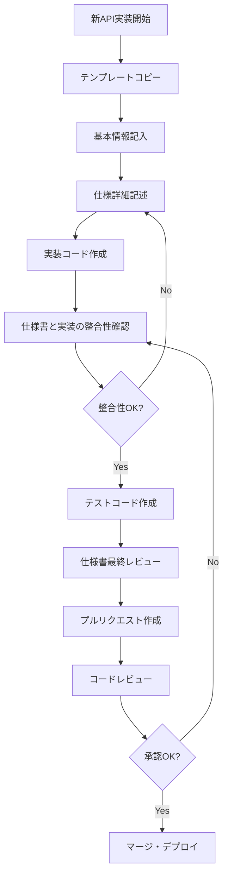

# API仕様書作成ガイドライン

*作成日: 2025年8月23日*  
*対象: Next.jsボイラープレート開発チーム*  
*バージョン: 1.0.0*

## 🎯 目的

このガイドラインは、プロジェクト内のAPI仕様書の品質統一と作成効率化を目的としています。すべての開発者が一貫した形式でAPI仕様書を作成できるよう、具体的な手順と基準を定めています。

## 📋 作成プロセス

### 1. 事前準備（Planning）

#### ✅ チェックリスト
- [ ] **APIの目的と機能を明確化**
- [ ] **エンドポイント設計の確認**
- [ ] **認証・認可要件の確認**
- [ ] **データモデルの設計完了**
- [ ] **エラーハンドリング方針の決定**

#### 🔍 設計レビューポイント
```typescript
interface DesignReviewCriteria {
  functionality: {
    purpose: '明確で単一責任';
    endpoint: 'RESTful原則準拠';
    method: '適切なHTTPメソッド選択';
  };
  
  security: {
    authentication: '認証方式の適切性';
    authorization: '認可レベルの妥当性';
    validation: '入力検証の網羅性';
  };
  
  performance: {
    caching: 'キャッシュ戦略の検討';
    pagination: 'ページネーション実装';
    rateLimit: 'レート制限の設定';
  };
}
```

### 2. 仕様書作成（Documentation）

#### 📝 作成手順

1. **テンプレートのコピー**
   ```bash
   cp docs/development/templates/API仕様書テンプレート.md \
      docs/reference/api/[endpoint-name].md
   ```

2. **基本情報の入力**
   - エンドポイント名とURL
   - HTTPメソッド
   - 認証要件
   - 実装ファイルパス

3. **リクエスト仕様の詳細記述**
   - URLパラメータ
   - クエリパラメータ  
   - リクエストボディ（TypeScript型定義含む）

4. **レスポンス仕様の詳細記述**
   - 成功レスポンス
   - エラーレスポンス
   - 具体例（JSON形式）

5. **エラーハンドリングの明記**
   - 全エラーコードとメッセージ
   - HTTPステータスコードの使い分け
   - 対処方法の説明

### 3. レビュー・検証（Review & Validation）

#### 🔍 レビュー観点

| 観点 | チェック項目 | 重要度 |
|------|-------------|--------|
| **完全性** | 全セクションが記入済み | 🔴 高 |
| **正確性** | 実装と仕様の一致 | 🔴 高 |
| **明確性** | 曖昧な表現がない | 🟡 中 |
| **一貫性** | 他のAPI仕様との統一性 | 🟡 中 |
| **実用性** | 実装者が理解できる | 🟡 中 |

#### ✅ 品質チェックリスト

##### 基本情報
- [ ] エンドポイント名が明確
- [ ] URLパスが正確
- [ ] HTTPメソッドが適切
- [ ] 認証要件が明記
- [ ] 作成日・更新日が正確

##### リクエスト仕様
- [ ] 全パラメータが網羅
- [ ] 型定義が正確
- [ ] 必須/任意の区別が明確
- [ ] デフォルト値が記載
- [ ] バリデーション規則が明確

##### レスポンス仕様  
- [ ] 成功・エラーレスポンスが網羅
- [ ] HTTPステータスコードが適切
- [ ] 型定義が正確
- [ ] 具体例が現実的

##### エラーハンドリング
- [ ] 全エラーコードが定義
- [ ] メッセージが分かりやすい
- [ ] 対処方法が具体的
- [ ] HTTPステータスが適切

### 4. 実装連携（Implementation Integration）

#### 🔗 実装との整合性確保

```typescript
// 実装とドキュメントの整合性チェックポイント
interface IntegrationCheckpoints {
  // 1. 型定義の一致確認
  typeDefinitions: {
    request: 'リクエスト型 = 実装型';
    response: 'レスポンス型 = 実装型'; 
    error: 'エラー型 = 実装型';
  };
  
  // 2. バリデーションルールの一致確認
  validation: {
    schema: 'Zodスキーマ = 仕様書記載';
    messages: 'エラーメッセージ = 仕様書記載';
  };
  
  // 3. ビジネスロジックの一致確認
  logic: {
    flow: '処理フロー = 仕様書記載';
    conditions: '条件分岐 = 仕様書記載';
  };
}
```

## 📐 品質基準

### 記述品質基準

#### ✅ 優良な記述例

```typescript
// ❌ 悪い例
interface BadExample {
  id: string;                    // ID
  data: any;                     // データ
}

// ✅ 良い例  
interface GoodExample {
  id: string;                    // ユニークなユーザーID (例: user_2Nkj8fKz9mQwR1vB)
  userData: {                    // ユーザー基本情報
    name: string;                // 表示名 (1-50文字)
    email: string;               // メールアドレス (RFC 5322準拠)
    createdAt: string;           // 作成日時 (ISO 8601形式)
  };
  preferences: UserPreferences;  // ユーザー設定オブジェクト
}
```

#### 🎯 記述ルール

1. **型注釈**: すべての型に詳細な説明を付ける
2. **制約条件**: 文字数制限、範囲、形式などを明記  
3. **具体例**: 実際の値例を可能な限り提供
4. **参照情報**: 関連する仕様書・RFC等を記載

### エラーメッセージ品質基準

#### ✅ 優良なエラーメッセージ

```typescript
// ❌ 悪い例
{
  \"error\": \"Invalid input\"
}

// ✅ 良い例
{
  \"error\": {
    \"code\": \"VALIDATION_ERROR\",
    \"message\": \"入力データの形式が正しくありません\",
    \"details\": \"emailフィールドは有効なメールアドレス形式である必要があります（例: user@example.com）\",
    \"field\": \"email\",
    \"rejectedValue\": \"invalid-email\"
  }
}
```

#### 🎯 エラーメッセージルール

1. **具体性**: 何が間違っているかを具体的に説明
2. **建設性**: どうすれば修正できるかを提示
3. **一貫性**: プロジェクト全体で用語・形式を統一
4. **多言語対応**: 将来の国際化を考慮した設計

## 🔧 ツールと自動化

### 仕様書検証ツール

```typescript
// 仕様書品質チェックツールの設計
interface SpecValidationTool {
  // マークダウン構文チェック
  markdownLint: {
    rules: ['MD001', 'MD003', 'MD022', 'MD025'];
    severity: 'error' | 'warning';
  };
  
  // リンク整合性チェック
  linkValidation: {
    internal: '内部リンクの存在確認';
    external: '外部リンクの有効性確認';
    anchors: 'アンカーリンクの有効性確認';
  };
  
  // 実装整合性チェック
  implementationSync: {
    typeCheck: 'TypeScript型定義との比較';
    schemaCheck: 'Zodスキーマとの比較';
    testCoverage: 'テストケースの網羅性確認';
  };
}
```

### 自動生成機能

```typescript
// API仕様書自動生成の設計
interface AutoGenerationFeatures {
  // TypeScript型からの生成
  fromTypes: {
    input: 'TypeScript型定義ファイル';
    output: 'リクエスト・レスポンス仕様セクション';
    tool: 'typescript-json-schema';
  };
  
  // Zodスキーマからの生成
  fromZodSchema: {
    input: 'Zodバリデーションスキーマ';
    output: 'バリデーション規則セクション';
    tool: 'zod-to-json-schema';
  };
  
  // OpenAPI仕様書からの生成
  fromOpenAPI: {
    input: 'OpenAPI 3.0仕様書';
    output: '完全なAPI仕様書';
    tool: 'swagger-codegen';
  };
}
```

## 📚 実践ワークフロー

### 日常的な作業フロー



### チーム連携ポイント

#### 🤝 レビュー体制

| 役割 | レビュー観点 | タイミング |
|------|-------------|-----------|
| **実装者** | 技術的正確性・実装可能性 | 作成時・実装時 |
| **チームリーダー** | 設計方針・アーキテクチャ整合性 | 作成完了時 |
| **QAエンジニア** | テスト観点・エラーハンドリング | PR作成時 |
| **プロダクトマネージャー** | 機能要件・ユーザー体験 | 設計レビュー時 |

#### 📢 コミュニケーションルール

1. **仕様変更時**: 関係者全員に事前通知
2. **レビュー期間**: 最大2営業日以内の レスポンス
3. **議論記録**: 設計決定の背景をドキュメント化
4. **ナレッジ共有**: 学習ポイントをチーム内で共有

## 🎓 ベストプラクティス

### 💡 効率化テクニック

#### 1. テンプレートのカスタマイズ

```typescript
// プロジェクト固有のテンプレート変数
interface TemplateVariables {
  projectName: 'Next.jsボイラープレート';
  authMethod: 'NextAuth.js v5 JWT';
  errorHandling: '統一エラーレスポンス形式';
  
  // 頻繁に使用する型定義を事前定義
  commonTypes: {
    UserId: 'string';             // ユーザーID形式
    Timestamp: 'string';          // ISO 8601日時形式
    PaginationQuery: 'object';    // ページネーション形式
  };
}
```

#### 2. 段階的ドキュメント作成

```typescript
// 段階的作成アプローチ
interface IncrementalApproach {
  // Phase 1: 最小限の仕様書
  minimal: {
    sections: ['基本情報', 'リクエスト概要', 'レスポンス概要'];
    purpose: '早期の設計レビューとフィードバック収集';
  };
  
  // Phase 2: 詳細仕様書  
  detailed: {
    sections: ['エラーハンドリング', '具体例', 'テスト仕様'];
    purpose: '実装開始とテストケース作成';
  };
  
  // Phase 3: 完全版仕様書
  complete: {
    sections: ['パフォーマンス', '変更履歴', '関連文書'];
    purpose: '運用開始とメンテナンス';
  };
}
```

### ⚠️ 注意すべき落とし穴

#### 1. 仕様書と実装の乖離

**問題**: 実装後に仕様書の更新を忘れる

**対策**:
- [ ] 実装完了時の仕様書更新をタスクに含める
- [ ] CI/CDパイプラインでの整合性チェック自動化
- [ ] 定期的な仕様書・実装間の監査実施

#### 2. 過度に詳細な仕様書

**問題**: 不要な詳細記述による保守コスト増加

**対策**:
- [ ] 「重要な情報」と「参考情報」の明確な区別
- [ ] 仕様変更頻度の高い部分は簡潔に記述
- [ ] 自動生成可能な部分は手動記述を避ける

#### 3. エラーハンドリングの不備

**問題**: エッジケースやエラー状況の考慮不足

**対策**:
- [ ] エラーケースの網羅的な洗い出し
- [ ] ユーザー目線でのエラーメッセージ検証
- [ ] 実際の運用で発生しうるエラーの事前想定

## 📈 継続的改善

### 品質向上サイクル

```typescript
interface ImprovementCycle {
  // 1. 現状分析（月次）
  analysis: {
    metrics: ['仕様書完成度', '実装整合性', 'レビュー指摘数'];
    feedback: '開発者・レビューアーからの改善提案';
    issues: '仕様書起因の問題・バグの分析';
  };
  
  // 2. 改善計画（四半期）
  planning: {
    priorities: '改善優先度の決定';
    resources: '改善作業のリソース確保';
    timeline: '改善実施スケジュール';
  };
  
  // 3. 改善実施
  implementation: {
    templates: 'テンプレートの更新・追加';
    tools: '支援ツールの開発・導入';
    processes: 'ワークフローの見直し';
  };
  
  // 4. 効果測定
  measurement: {
    before: '改善前のベースライン測定';
    after: '改善後の効果測定';
    roi: '投資対効果の算出';
  };
}
```

### 成功指標（KPI）

| 指標 | 目標値 | 現在値 | 測定方法 |
|------|--------|--------|----------|
| **仕様書完成度** | >90% | - | チェックリスト充足率 |
| **実装整合性** | >95% | - | 自動チェックツール |
| **レビュー効率** | <2日 | - | レビューサイクル時間 |
| **仕様変更頻度** | <10% | - | 実装後変更率 |
| **開発者満足度** | >4.0/5 | - | 四半期アンケート |

---

## 🔗 関連リソース

### 📋 テンプレート・ツール

- [API仕様書テンプレート](./API仕様書テンプレート.md)
- [エラーコード一覧表](../reference/error-codes.md)
- [認証システム仕様](../reference/authentication-system.md)

### 📖 参考文献

- [RESTful API設計ガイド](https://restfulapi.net/)
- [OpenAPI 3.0 仕様書](https://swagger.io/specification/)
- [HTTPステータスコード一覧](https://developer.mozilla.org/en-US/docs/Web/HTTP/Status)
- [Next.js App Router API Routes](https://nextjs.org/docs/app/building-your-application/routing/route-handlers)

### 🛠️ 開発ツール

- [Swagger Editor](https://editor.swagger.io/) - OpenAPI仕様書編集
- [Insomnia](https://insomnia.rest/) - API テストクライアント
- [Zod](https://zod.dev/) - TypeScriptスキーマバリデーション

---

*このガイドラインは、チーム全体のAPI仕様書品質向上と作業効率化を目的として作成されました。定期的な見直しと改善により、より良いドキュメント作成文化を築いていきましょう。*

*次回レビュー予定: 2025年11月23日*