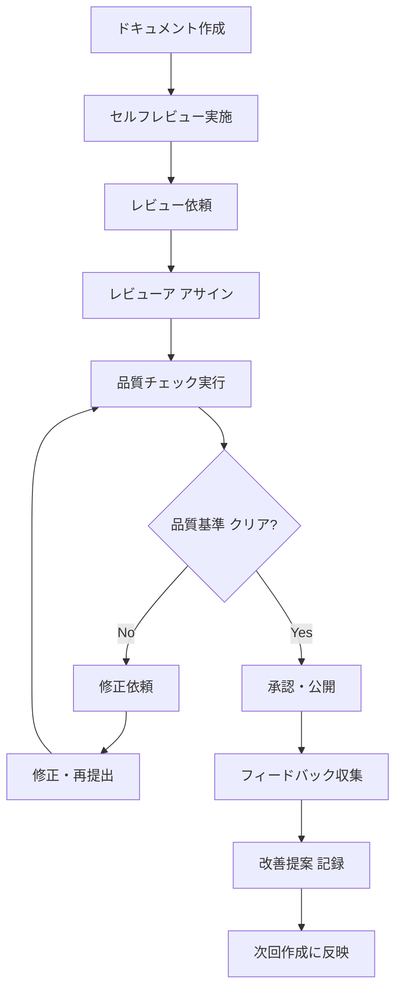

# ドキュメントレビュープロセス

*作成日: 2025年8月23日*  
*対象: Next.jsボイラープレートプロジェクト*  
*バージョン: 1.0.0*

## 🎯 概要と目的

### レビューシステムの目的

このドキュメントレビュープロセスは、プロジェクトの全ドキュメントの品質統一、情報の正確性確保、そして継続的な改善を実現するために策定されました。すべての開発者とステークホルダーが一貫した品質基準でドキュメントを作成・レビューできる環境を提供します。

### レビューの基本原則

1. **品質ファースト**: 速度より正確性と完全性を優先
2. **建設的フィードバック**: 改善提案中心の前向きなレビュー
3. **継続的改善**: レビュー結果を次回作成に活用
4. **透明性**: レビュー基準とプロセスの公開・共有
5. **効率性**: 適切な工数で最大の品質向上効果

## 📋 レビュープロセス全体図

### ワークフロー



### レビュー段階

#### 段階1: 作成者セルフレビュー
- **実施者**: 文書作成者
- **所要時間**: 15-30分
- **目的**: 基本的な品質チェックと整合性確認

#### 段階2: ピアレビュー
- **実施者**: 同等レベルの開発者・専門家
- **所要時間**: 30-60分
- **目的**: 技術的正確性と実用性の検証

#### 段階3: 最終承認
- **実施者**: プロジェクトリーダー・上級者
- **所要時間**: 15-30分
- **目的**: プロジェクト全体との整合性確認

## ✅ セルフレビューチェックリスト

### 📝 基本構成チェック

#### ドキュメント構造
- [ ] **タイトルが明確**: 内容を的確に表現
- [ ] **作成日・更新日が記載**: 情報の新しさが判断可能
- [ ] **対象読者が明確**: 想定する読み手が特定されている
- [ ] **目次が適切**: 構造が理解しやすい
- [ ] **章立てが論理的**: 情報の流れが自然

#### 内容の完全性
- [ ] **目的が明示**: なぜこの文書が必要かが明確
- [ ] **前提条件が明記**: 読者が知っておくべき前提知識
- [ ] **手順が具体的**: 実際に実行可能なレベルで記述
- [ ] **注意点が記載**: リスクや制約事項の説明
- [ ] **参考資料のリンク**: 関連情報への適切な誘導

### 🔍 技術的正確性チェック

#### コードサンプル
- [ ] **構文エラーなし**: コードが実際に動作する
- [ ] **最新バージョン対応**: 使用技術の現在のバージョンに準拠
- [ ] **適切な説明**: コードの目的と動作が説明されている
- [ ] **セキュリティ考慮**: セキュリティリスクが含まれていない
- [ ] **ベストプラクティス**: 推奨される手法が使用されている

#### 技術情報
- [ ] **バージョン情報正確**: 依存関係やツールバージョンが最新
- [ ] **設定情報最新**: 設定ファイルやパラメータが現在の環境に適合
- [ ] **パスや名前正確**: ファイルパス、関数名、変数名が実際と一致
- [ ] **外部リンク有効**: 参照先URLが有効でアクセス可能

### 📖 文書品質チェック

#### 読みやすさ
- [ ] **文章が明確**: 曖昧な表現や専門用語の過度な使用がない
- [ ] **構文が正しい**: 誤字脱字、文法エラーがない  
- [ ] **適切な長さ**: 1文が長すぎず、適度な改行がある
- [ ] **統一された用語**: 同一概念に対して一貫した用語使用
- [ ] **視覚的配慮**: 適切な見出し、箇条書き、強調の使用

#### 理解しやすさ
- [ ] **段階的説明**: 簡単から複雑へ、概要から詳細への流れ
- [ ] **具体例が豊富**: 抽象的な説明に対する実例の提示
- [ ] **図表の効果的使用**: 文字だけでは分かりにくい部分の視覚化
- [ ] **想定読者に配慮**: 読者のレベルに応じた説明の深さ

## 👥 ピアレビューガイドライン

### レビューア選定基準

#### 必須要件
- プロジェクトの技術スタックと業務領域に精通
- ドキュメント作成・レビュー経験1年以上
- 建設的なフィードバック提供能力

#### 望ましい条件
- 対象分野での専門知識・実装経験
- ドキュメント品質向上への積極的姿勢
- プロジェクト全体への理解と関心

### レビュー実施手順

#### 1. 事前準備（5-10分）
```typescript
interface ReviewPreparation {
  // レビュー対象文書の基本情報確認
  documentInfo: {
    title: string;
    author: string;
    target_audience: string;
    purpose: string;
  };
  
  // レビューに必要な資料準備
  referenceDocuments: {
    related_specs: string[];
    implementation_files: string[];
    existing_docs: string[];
  };
  
  // レビュー観点の確認
  review_focus: {
    technical_accuracy: boolean;
    practical_usability: boolean;
    consistency: boolean;
    completeness: boolean;
  };
}
```

#### 2. 第一読み（10-15分）
- **全体把握**: 文書全体の構造と流れを理解
- **目的確認**: 文書の目的と対象読者の明確さチェック
- **大枠評価**: 内容の適切性と完全性の初期評価

#### 3. 詳細レビュー（20-30分）
- **技術的正確性**: コード、設定、手順の検証
- **実用性確認**: 実際に手順を実行して動作確認
- **一貫性チェック**: 他文書との整合性、用語統一確認
- **改善提案**: より良い表現や構成の提案

#### 4. フィードバック作成（10-15分）
- **優良点の明示**: 良い点を具体的に評価
- **改善点の提案**: 建設的な修正案を提示  
- **重要度分類**: クリティカル・推奨・提案の3段階分類

### レビューフィードバック形式

#### 📝 レビュー結果テンプレート

```markdown
## レビュー結果報告

**文書名**: [対象文書名]
**レビューア**: [レビューア名]
**レビュー日**: [YYYY-MM-DD]
**レビュー時間**: [実際の所要時間]分

### ✅ 優良点
- [具体的な優れている点を記載]
- [読みやすさ、技術的正確性など]
- [他の文書の参考となる点]

### 🔍 改善提案

#### 🔴 クリティカル（必須修正）
- [ ] **[項目]**: [具体的な問題点と修正案]
- [ ] **[項目]**: [修正理由と推奨手法]

#### 🟡 推奨修正
- [ ] **[項目]**: [より良くするための提案]
- [ ] **[項目]**: [代替案や改善アイデア]

#### 🟢 提案・参考
- [ ] **[項目]**: [将来的な改善案]
- [ ] **[項目]**: [より良い表現例]

### 📊 総合評価
| 評価項目 | スコア | コメント |
|----------|--------|----------|
| **技術的正確性** | ⭐⭐⭐⭐⭐ | [具体的な評価理由] |
| **実用性** | ⭐⭐⭐⭐⭐ | [実際の使いやすさ] |
| **完全性** | ⭐⭐⭐⭐⭐ | [必要情報の網羅性] |
| **読みやすさ** | ⭐⭐⭐⭐⭐ | [理解のしやすさ] |

**承認可否**: ✅承認 / ❌要修正 / ⚠️条件付承認

### 💡 追加コメント
[全体的な感想、次回への改善提案など]
```

## 🏆 品質基準・評価クライテリア

### 評価項目定義

#### 技術的正確性（Technical Accuracy）
| レベル | 基準 | 例 |
|--------|------|---|
| ⭐⭐⭐⭐⭐ | 完璧 | すべてのコード・設定が検証済み、エラーなし |
| ⭐⭐⭐⭐☆ | 優秀 | 軽微な改善点があるが実用上問題なし |
| ⭐⭐⭐☆☆ | 良好 | 一部修正が必要だが基本的に正確 |
| ⭐⭐☆☆☆ | 要改善 | 複数の技術的問題が存在 |
| ⭐☆☆☆☆ | 不適切 | 重大な技術的誤りがあり修正必須 |

#### 実用性（Practical Usability）
| レベル | 基準 | 例 |
|--------|------|---|
| ⭐⭐⭐⭐⭐ | 完璧 | 初心者でも迷わず実行可能な手順 |
| ⭐⭐⭐⭐☆ | 優秀 | 一般的な開発者が容易に実行可能 |
| ⭐⭐⭐☆☆ | 良好 | 中級者以上なら問題なく実行可能 |
| ⭐⭐☆☆☆ | 要改善 | 説明不足で実行に困難を伴う |
| ⭐☆☆☆☆ | 不適切 | 実際には実行できない・非現実的 |

#### 完全性（Completeness）
| レベル | 基準 | 例 |
|--------|------|---|
| ⭐⭐⭐⭐⭐ | 完璧 | すべての必要情報が適切に含まれている |
| ⭐⭐⭐⭐☆ | 優秀 | ほぼ完全、軽微な補強で完璧になる |
| ⭐⭐⭐☆☆ | 良好 | 主要情報は含まれているが一部不足 |
| ⭐⭐☆☆☆ | 要改善 | 重要な情報がいくつか不足している |
| ⭐☆☆☆☆ | 不適切 | 基本的な情報が大幅に不足 |

#### 読みやすさ（Readability）
| レベル | 基準 | 例 |
|--------|------|---|
| ⭐⭐⭐⭐⭐ | 完璧 | 構造明確、文章明快、視覚的に優れている |
| ⭐⭐⭐⭐☆ | 優秀 | 読みやすく、軽微な改善で完璧になる |
| ⭐⭐⭐☆☆ | 良好 | 一般的な読みやすさ、改善の余地あり |
| ⭐⭐☆☆☆ | 要改善 | 理解に努力が必要、構造や文章に問題 |
| ⭐☆☆☆☆ | 不適切 | 理解困難、大幅な改善が必要 |

### 合格基準

#### 最低合格基準
- **全項目で⭐⭐⭐以上**
- **クリティカル問題が0件**
- **推奨修正項目が3件以下**

#### 優秀認定基準
- **全項目で⭐⭐⭐⭐以上**
- **クリティカル・推奨修正が0件**
- **他文書の参考となる優良事例**

## ⚡ 迅速レビュー（Fast Track）

### 適用条件
1. **軽微な修正**: 誤字脱字、リンク更新等
2. **定期更新**: バージョン番号、日付更新等
3. **緊急性**: 重要度高く即時対応が必要

### 簡易チェックリスト
- [ ] **基本情報正確**: 日付、バージョン、作成者情報
- [ ] **リンク確認**: 内部・外部リンクの有効性
- [ ] **表記統一**: 用語、表現の一貫性
- [ ] **文法チェック**: 誤字脱字、基本的な文法
- [ ] **フォーマット**: マークダウン記法の正確性

### 承認フロー
```
作成者セルフチェック → 担当者承認 → 即時公開
（所要時間: 15分以内）
```

## 📊 レビュー実績管理

### 管理項目

#### レビュー統計
```typescript
interface ReviewMetrics {
  monthly_stats: {
    total_reviews: number;
    average_review_time: number; // minutes
    approval_rate: number; // percentage
    improvement_suggestions: number;
  };
  
  quality_trends: {
    technical_accuracy: number[]; // monthly averages
    practical_usability: number[];
    completeness: number[];
    readability: number[];
  };
  
  reviewer_performance: {
    reviewer_id: string;
    reviews_completed: number;
    average_feedback_quality: number;
    response_time: number; // hours
  }[];
}
```

#### 品質向上トラッキング
- **月次品質スコア**: 各評価項目の平均推移
- **問題カテゴリ分析**: 頻出する問題タイプ
- **改善効果測定**: 修正前後の品質変化
- **レビューア成長**: 個人のレビュー品質向上

### レポーティング

#### 月次品質レポート
```markdown
## ドキュメント品質レポート - 2025年8月

### 📈 全体統計
- **総レビュー数**: 15件
- **平均レビュー時間**: 42分
- **承認率**: 87%
- **改善提案数**: 38件

### 📊 品質スコア推移
| 評価項目 | 7月 | 8月 | 変化 |
|----------|-----|-----|------|
| 技術的正確性 | 4.1 | 4.3 | ⬆️ +0.2 |
| 実用性 | 3.8 | 4.0 | ⬆️ +0.2 |
| 完全性 | 3.9 | 4.2 | ⬆️ +0.3 |
| 読みやすさ | 4.2 | 4.4 | ⬆️ +0.2 |

### 🔍 主な改善点
1. **技術情報の最新性向上**: バージョン情報の定期更新
2. **コードサンプル品質**: 動作確認済みコードの増加
3. **構造改善**: 読みやすい章立ての統一

### 💡 来月の重点項目
- [ ] API仕様書テンプレートの活用促進
- [ ] レビュー時間短縮（目標: 35分以内）
- [ ] 新規レビューア向けトレーニング実施
```

## 🔄 継続的改善システム

### フィードバック収集メカニズム

#### 文書利用者からの意見収集
```typescript
interface UserFeedback {
  document_id: string;
  user_type: 'developer' | 'designer' | 'manager' | 'external';
  feedback_type: 'accuracy' | 'usability' | 'completeness' | 'suggestion';
  rating: 1 | 2 | 3 | 4 | 5;
  comment: string;
  improvement_suggestion?: string;
}
```

#### レビューア向け改善提案
```typescript
interface ReviewerImprovement {
  reviewer_id: string;
  proposed_changes: {
    process_improvements: string[];
    checklist_additions: string[];
    training_needs: string[];
  };
  success_stories: string[];
  challenges_faced: string[];
}
```

### 改善実装サイクル

#### 四半期改善計画
1. **フィードバック分析** (第1週)
   - 利用者・レビューア意見の集約
   - 品質データの統計分析
   - 改善優先度の決定

2. **改善案策定** (第2週)
   - プロセス改善案の作成
   - チェックリスト項目の見直し
   - ツール・システム改善検討

3. **試行実装** (第3週)
   - 小規模での改善案試行
   - 効果測定とフィードバック収集
   - 必要に応じた調整実施

4. **本格導入** (第4週以降)
   - 改善策の全面導入
   - チーム向けトレーニング実施
   - 新基準でのレビュー開始

### 成功指標・KPI

#### プロセス改善KPI
| 指標 | 現在値 | 目標値 | 測定方法 |
|------|--------|--------|----------|
| **レビュー完了時間** | 2.5日 | 1.5日 | 依頼→承認間隔 |
| **修正回数** | 1.8回 | 1.2回 | 1文書あたり平均 |
| **品質スコア** | 4.1/5 | 4.5/5 | 4項目平均 |
| **ユーザー満足度** | 82% | 90% | 四半期アンケート |

#### 継続的学習目標
- **レビューアスキル**: 定期的なトレーニング参加
- **新技術対応**: 技術スタック更新への迅速対応
- **ベストプラクティス**: 他プロジェクト成功事例の導入
- **自動化推進**: レビュー支援ツールの活用

---

## 🛠️ ツール・システム統合

### レビュー支援ツール

#### 自動チェックシステム
```typescript
interface AutomatedChecks {
  // マークダウン品質チェック
  markdown_lint: {
    rules: ['MD001', 'MD003', 'MD022', 'MD025'];
    severity: 'error' | 'warning' | 'info';
  };
  
  // リンク有効性確認
  link_checker: {
    internal_links: boolean;
    external_links: boolean;
    anchor_links: boolean;
  };
  
  // 技術情報整合性
  tech_consistency: {
    version_check: boolean;
    code_syntax: boolean;
    dependency_validation: boolean;
  };
}
```

#### レビュー管理システム
```typescript
interface ReviewManagement {
  // レビュー依頼・アサインメント
  assignment: {
    auto_assignment: boolean;
    expertise_matching: boolean;
    workload_balancing: boolean;
  };
  
  // 進捗トラッキング
  tracking: {
    status_monitoring: boolean;
    deadline_alerts: boolean;
    escalation_rules: boolean;
  };
  
  // 品質メトリクス
  metrics: {
    real_time_dashboard: boolean;
    trend_analysis: boolean;
    comparative_reports: boolean;
  };
}
```

### 統合ワークフロー

#### GitHub統合
```yaml
# .github/workflows/doc-review.yml
name: Document Review Automation

on:
  pull_request:
    paths: ['docs/**/*.md']

jobs:
  auto-check:
    runs-on: ubuntu-latest
    steps:
      - name: Markdown Lint
        run: markdownlint docs/
      
      - name: Link Check
        run: markdown-link-check docs/**/*.md
      
      - name: Tech Consistency
        run: npm run doc-check
  
  assign-reviewer:
    needs: auto-check
    runs-on: ubuntu-latest
    steps:
      - name: Auto Assign Reviewer
        uses: ./.github/actions/assign-doc-reviewer
```

## 📚 参考資料・関連文書

### 内部ドキュメント
- [API仕様書テンプレート](./templates/API仕様書テンプレート.md)
- [API仕様書作成ガイドライン](./templates/API仕様書作成ガイドライン.md)
- [ドキュメント自動更新システム設計書](./plans/ドキュメント自動更新システム設計書.md)

### 外部参考資料
- [Google Technical Writing Course](https://developers.google.com/tech-writing)
- [Write the Docs Community](https://www.writethedocs.org/)
- [Microsoft Style Guide](https://docs.microsoft.com/en-us/style-guide/)
- [Red Hat Technical Writing Guide](https://redhat-documentation.github.io/)

### ツール・リソース
- [Markdownlint](https://github.com/markdownlint/markdownlint) - マークダウン品質チェック
- [markdown-link-check](https://github.com/tcort/markdown-link-check) - リンク有効性確認
- [Alex](https://github.com/get-alex/alex) - インクルーシブな文章チェック
- [Hemingway Editor](http://www.hemingwayapp.com/) - 文章読みやすさ改善

---

*このドキュメントレビュープロセスは、Next.jsボイラープレートプロジェクトの継続的な品質向上と効率的なドキュメント管理を実現するために策定されました。*

*定期見直し予定: 四半期ごと（次回: 2025年11月末）*