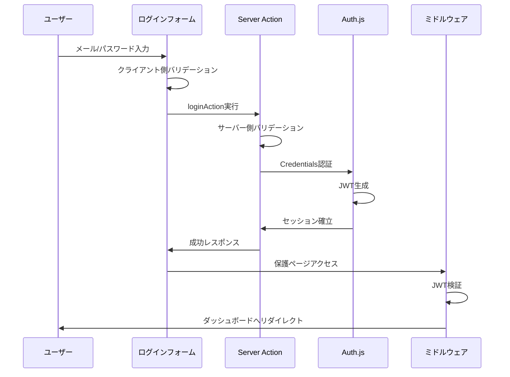
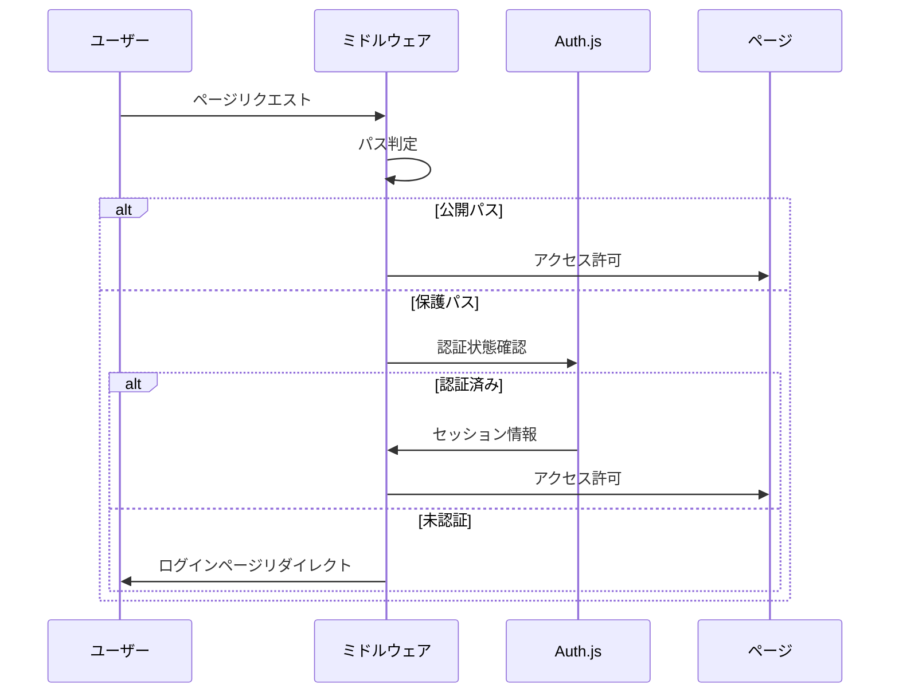

# 認証システム実装ガイド

このドキュメントは、Next.js Boilerplateの認証システムの実装状況と構成について詳細に説明したものです。

## 目次

- [認証システム概要](#認証システム概要)
- [アーキテクチャ構成](#アーキテクチャ構成)
- [主要コンポーネント](#主要コンポーネント)
- [認証フロー](#認証フロー)
- [実装詳細](#実装詳細)
- [セキュリティ機能](#セキュリティ機能)
- [開発・テスト情報](#開発テスト情報)
- [本番環境への移行準備](#本番環境への移行準備)

## 認証システム概要

### 基盤技術

- **Auth.js v5 (NextAuth)**: 業界標準の認証ライブラリ
- **JWT戦略**: データベース不要のステートレス認証
- **Credentials Provider**: メール/パスワード認証方式
- **TypeScript**: 完全な型安全性

### 特徴

- 🔐 **多層防御**: CSRF、レート制限、セキュリティヘッダー
- 🎯 **型安全**: TypeScript + Zod による厳密なバリデーション
- ♿ **アクセシビリティ**: WCAG 2.1 AA準拠
- 🚀 **高パフォーマンス**: React 19 Compiler最適化
- 🔧 **拡張性**: プロバイダー追加やDB統合が容易

## アーキテクチャ構成

```
[クライアント] ↔ [ミドルウェア] ↔ [Auth.js] ↔ [JWT Token]
     ↓               ↓              ↓
[認証ページ]    [保護 + CSRF +   [Server Actions]
[認証コンポーネント] レート制限]   [API Routes]
```

### ディレクトリ構造

```
src/
├── lib/auth/                    # 認証設定とロジック
│   ├── index.ts                 # Auth.js設定
│   ├── actions.ts               # Server Actions
│   ├── types.ts                 # TypeScript型定義
│   ├── auth-errors.ts           # エラー定義
│   └── test-data.ts             # テスト用データ
├── app/(auth)/                  # 認証ページ
│   ├── layout.tsx               # 認証レイアウト
│   ├── login/page.tsx           # ログインページ
│   └── register/page.tsx        # 新規登録ページ
├── app/api/auth/                # API エンドポイント
│   ├── [...nextauth]/route.ts   # Auth.js標準API
│   └── register/route.ts        # 新規登録API
├── components/auth/             # 認証コンポーネント
│   ├── login-form.tsx           # ログインフォーム
│   ├── register-form.tsx        # 新規登録フォーム
│   ├── login-form-error.tsx     # エラー表示
│   └── user-auth-menu.tsx       # ユーザーメニュー
└── middleware.ts                # 認証・セキュリティ保護
```

## 主要コンポーネント

### 1. 認証設定 (`/src/lib/auth/`)

#### **index.ts** - Auth.js設定
- JWT戦略によるセッション管理
- Credentials Providerの設定
- ルートベースのアクセス制御

#### **actions.ts** - Server Actions
- `loginAction`: 型安全なログイン処理
- `logoutAction`: ログアウト処理
- Zodスキーマによるバリデーション

#### **types.ts** - TypeScript型定義
```typescript
// 基本ユーザー属性
CommonUserAttributes: {
  id: string;
  email: string;
  name: string;
}

// ユーザーロール
UserRole: "admin" | "user"

// 完全なプロフィール情報
UserProfile: CommonUserAttributes & {
  role: UserRole;
  createdAt: Date;
  updatedAt: Date;
}
```

#### **auth-errors.ts** - エラーハンドリング
- 統一されたエラーコード定義
- ユーザーフレンドリーなメッセージ
- 多言語対応準備

### 2. 認証ページ (`/src/app/(auth)/`)

#### **layout.tsx** - 共通レイアウト
- シンプルなヘッダー（アプリ名のみ）
- 中央配置のコンテンツエリア
- フッター表示

#### **login/page.tsx** - ログインページ
- サーバーコンポーネント
- SEO最適化メタデータ
- LoginFormコンポーネント統合

#### **register/page.tsx** - 新規登録ページ
- サーバーコンポーネント
- SEO最適化メタデータ
- RegisterFormコンポーネント統合

### 3. 認証コンポーネント (`/src/components/auth/`)

#### **login-form.tsx** - ログインフォーム
- `useLoginForm`カスタムフック使用
- 自動リダイレクト機能
- エラーメッセージ表示
- アクセシビリティ対応

#### **register-form.tsx** - 新規登録フォーム
- React Hook Form + Zod統合
- リアルタイムバリデーション
- トースト通知表示

#### **user-auth-menu.tsx** - ユーザーメニュー
- 認証状態に応じた表示切り替え
- ドロップダウンメニュー
- 管理者用項目表示
- アバター表示

### 4. API エンドポイント (`/src/app/api/auth/`)

#### **[...nextauth]/route.ts** - Auth.js標準API
提供されるエンドポイント：
- `/api/auth/signin` - ログイン処理
- `/api/auth/signout` - ログアウト処理  
- `/api/auth/session` - セッション情報取得
- `/api/auth/providers` - プロバイダー一覧
- `/api/auth/csrf` - CSRFトークン取得

#### **register/route.ts** - 新規登録API
- CSRF保護機能
- Zodバリデーション
- 統一エラーレスポンス
- 現状は仮実装（DB保存未実装）

## 認証フロー

### ログイン処理フロー



### アクセス制御フロー



## 実装詳細

### セッション管理

```typescript
// JWT設定例
session: {
  strategy: "jwt",
  maxAge: 30 * 24 * 60 * 60, // 30日
},

// セッション情報
interface Session {
  user: {
    id: string;
    email: string;
    name: string;
    role: "user" | "admin";
  }
}
```

### ルートアクセス制御

```typescript
// 公開ルート（認証不要）
const PUBLIC_PATHS = [
  "/",
  "/login", 
  "/register",
  "/about",
  "/services",
  "/contact"
];

// 保護ルート（要認証）
const PROTECTED_PATHS = [
  "/profile",
  "/dashboard"
];
```

### バリデーションスキーマ

```typescript
// ログインスキーマ
const loginSchema = z.object({
  email: z.string().email("有効なメールアドレスを入力してください"),
  password: z.string().min(6, "パスワードは6文字以上で入力してください")
});

// 新規登録スキーマ
const registerSchema = z.object({
  name: z.string().min(1, "氏名は必須です"),
  email: z.string().email("有効なメールアドレスを入力してください"),
  password: z.string().min(8, "パスワードは8文字以上で入力してください"),
  confirmPassword: z.string(),
  agreeToTerms: z.boolean().refine(val => val, "利用規約に同意してください")
}).refine(data => data.password === data.confirmPassword, {
  message: "パスワードが一致しません",
  path: ["confirmPassword"]
});
```

## セキュリティ機能

### ミドルウェア保護 (`middleware.ts`)

#### **1. CSRF保護**
- Originヘッダー検証
- 二重トークン方式
- 非安全メソッド（POST/PUT/DELETE等）に適用

```typescript
// CSRF検証の実装例
const validateCsrf = (request: NextRequest) => {
  const origin = request.headers.get("origin");
  const host = request.headers.get("host");
  
  if (origin && host && origin !== `https://${host}`) {
    throw new Error("CSRF: Origin mismatch");
  }
};
```

#### **2. レート制限**
- IPアドレスベース
- 10秒間に20リクエストまで
- `/api`、`/login`、`/register`に適用

#### **3. セキュリティヘッダー**
```typescript
const securityHeaders = {
  "X-Content-Type-Options": "nosniff",
  "X-Frame-Options": "DENY", 
  "X-XSS-Protection": "1; mode=block"
};
```

### エラーハンドリング

```typescript
// 統一エラーコード
enum AUTH_ERROR_CODES {
  INVALID_CREDENTIALS = "INVALID_CREDENTIALS",
  USER_NOT_FOUND = "USER_NOT_FOUND",
  ACCOUNT_LOCKED = "ACCOUNT_LOCKED"
}

// エラーメッセージマッピング
const getErrorMessage = (code: string, attemptCount?: number) => {
  // 試行回数に応じた詳細メッセージ提供
};
```

## 開発・テスト情報

### テストユーザー

開発環境で利用可能なテストアカウント：

```typescript
// /src/lib/auth/test-data.ts
const testUsers = [
  {
    email: "user@example.com",
    password: "password123",
    role: "user"
  },
  {
    email: "admin@example.com", 
    password: "password123",
    role: "admin"
  }
];
```

**⚠️ 注意**: テストユーザーは開発環境でのみ有効。本番環境では自動的に無効化されます。

### 環境変数

```env
# 必須環境変数
AUTH_SECRET=your-secret-key-min-32-chars

# 開発環境のみ
SHOW_EXAMPLES=true  # サンプルページ表示制御
```

### カスタムフック

#### **useAuth**
```typescript
const { 
  user,           // ユーザー情報
  loading,        // ロード状態
  authenticated,  // 認証状態
  login,          // ログイン関数
  logout          // ログアウト関数
} = useAuth();
```

#### **useLoginForm**
```typescript
const {
  form,           // React Hook Form instance
  handleSubmit,   // フォーム送信処理
  isLoading,      // 送信中状態
  error,          // エラー情報
  attemptCount    // 試行回数
} = useLoginForm();
```

## 本番環境への移行準備

### 必須対応項目

#### **1. データベース統合**
現在はメモリ上でのテスト実装のため、実際のデータベース統合が必要：

```typescript
// 推奨: Drizzle ORM + PostgreSQL
import { pgTable, text, timestamp, pgEnum } from 'drizzle-orm/pg-core';
import { createId } from '@paralleldrive/cuid2';

// ロール定義
export const roleEnum = pgEnum('role', ['user', 'admin']);

// ユーザーテーブル定義
export const users = pgTable('users', {
  id: text('id').primaryKey().$defaultFn(() => createId()),
  email: text('email').notNull().unique(),
  name: text('name').notNull(),
  password: text('password').notNull(), // ハッシュ化済み
  role: roleEnum('role').default('user').notNull(),
  createdAt: timestamp('created_at').defaultNow().notNull(),
  updatedAt: timestamp('updated_at').defaultNow().notNull(),
});

// TypeScript型の自動生成
export type User = typeof users.$inferSelect;
export type NewUser = typeof users.$inferInsert;
```

#### **2. パスワード暗号化とDrizzle ORM操作**
```typescript
import bcrypt from 'bcryptjs';
import { drizzle } from 'drizzle-orm/postgres-js';
import { eq } from 'drizzle-orm';
import postgres from 'postgres';
import { users, type NewUser } from './schema';

// データベース接続
const client = postgres(process.env.DATABASE_URL!);
const db = drizzle(client);

// パスワードハッシュ化
const hashPassword = async (password: string) => {
  return bcrypt.hash(password, 12);
};

// パスワード検証
const verifyPassword = async (password: string, hash: string) => {
  return bcrypt.compare(password, hash);
};

// ユーザー作成
const createUser = async (userData: Omit<NewUser, 'id' | 'createdAt' | 'updatedAt'>) => {
  const hashedPassword = await hashPassword(userData.password);
  
  const [newUser] = await db.insert(users).values({
    ...userData,
    password: hashedPassword,
  }).returning();
  
  return newUser;
};

// ユーザー認証
const authenticateUser = async (email: string, password: string) => {
  const user = await db.select().from(users).where(eq(users.email, email)).limit(1);
  
  if (!user.length) {
    return null;
  }
  
  const isValid = await verifyPassword(password, user[0].password);
  return isValid ? user[0] : null;
};

// メールでユーザー検索
const getUserByEmail = async (email: string) => {
  const [user] = await db.select().from(users).where(eq(users.email, email)).limit(1);
  return user || null;
};
```

#### **3. メール機能実装**
- メール認証機能
- パスワードリセット機能  
- ウェルカムメール送信

#### **4. 追加セキュリティ**
- セッション管理の強化
- リフレッシュトークンの実装
- 監査ログの記録
- 二要素認証（2FA）の検討

### 推奨改善項目

#### **1. 認証プロバイダー拡張**
```typescript
// OAuth プロバイダー追加例
providers: [
  CredentialsProvider({ /* 既存設定 */ }),
  GoogleProvider({
    clientId: process.env.GOOGLE_CLIENT_ID!,
    clientSecret: process.env.GOOGLE_CLIENT_SECRET!,
  }),
  GitHubProvider({
    clientId: process.env.GITHUB_ID!,
    clientSecret: process.env.GITHUB_SECRET!,
  }),
]
```

#### **2. セッション永続化**

**Drizzle アダプターを使用した永続化:**
```typescript
// Drizzle を使用したセッション管理
import { DrizzleAdapter } from "@auth/drizzle-adapter";
import { drizzle } from "drizzle-orm/postgres-js";
import postgres from "postgres";

const client = postgres(process.env.DATABASE_URL!);
const db = drizzle(client);

export const authConfig = {
  adapter: DrizzleAdapter(db),
  // その他の設定
};
```

**Redis を使用したセッション管理例（代替案）:**
```typescript
import { RedisAdapter } from "@auth/redis-adapter";
import { Redis } from "@upstash/redis";

const redis = new Redis({
  url: process.env.UPSTASH_REDIS_REST_URL!,
  token: process.env.UPSTASH_REDIS_REST_TOKEN!,
});

export const authConfig = {
  adapter: RedisAdapter(redis),
  // その他の設定
};
```

#### **3. 高度な認証機能**
- 段階認証システム
- デバイス管理機能
- ログイン履歴の追跡
- 異常ログイン検知

## まとめ

この認証システムは、現代的なWebアプリケーションに必要な機能を網羅した堅牢な実装となっています。特に以下の点で優れています：

- **セキュリティ・ファースト設計**: 多層防御による包括的保護
- **開発者体験の向上**: 型安全性と統一されたエラーハンドリング
- **アクセシビリティ対応**: WCAG準拠による包括的利用
- **拡張性**: 将来的な機能追加に対する柔軟な対応

開発段階では十分に機能し、本番環境への移行時にはデータベース統合とセキュリティ強化を行うことで、エンタープライズレベルの認証システムとして利用可能です。