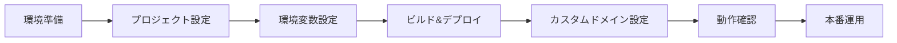
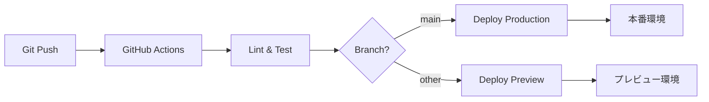

# Cloudflare Workers + OpenNext 完全デプロイガイド

> **最終更新**: 2026-01-09
> **バージョン**: v3.0（統合完全版）
> **対象**: Next.js 15.5.2 + @opennextjs/cloudflare 1.8.2
> **検証環境**: macOS + Node.js 20.x + wrangler 4.35.0

---

## 📖 はじめに

### このドキュメントについて

このガイドは、Next.js 15 + App Router + React 19 アプリケーションを Cloudflare Workers に完全にデプロイするための包括的なドキュメントです。初めてCloudflare Workersを使う方でも、手順通りに進めれば確実にデプロイできるように作成されています。

**このドキュメントの特徴:**
- ✅ 初回セットアップから本番デプロイまで全工程を網羅
- ✅ すべてのコマンドに成功時の出力例を掲載
- ✅ トラブルシューティングを豊富に用意
- ✅ チェックリスト形式で進捗を確認可能
- ✅ カスタムドメイン設定まで完全サポート

### 対象読者

- Next.js プロジェクトをCloudflare Workersにデプロイしたい方
- Cloudflare Workersを初めて使う方
- 本番環境へのデプロイ手順を確認したい方
- カスタムドメインでアプリケーションを公開したい方

### 所要時間の目安

| フェーズ | 所要時間 | 説明 |
|----------|----------|------|
| **Phase 1** | 約15分 | 環境準備（アカウント作成、認証設定） |
| **Phase 2** | 約20分 | プロジェクト設定（依存関係、設定ファイル） |
| **Phase 3** | 約10分 | 環境変数設定（シークレット管理） |
| **Phase 4** | 約10分 | ビルドとデプロイ |
| **Phase 5** | 約10分 | カスタムドメイン設定 |
| **Phase 6** | 約10分 | 動作確認 |
| **Phase 7** | 約15分 | 本番運用の準備 |
| **合計** | **約90分** | 初回デプロイ完了まで |

> **💡 Tips**: 2回目以降のデプロイは約5分で完了します。

### デプロイフロー全体図



---

## 🛠️ 技術スタック

### プロジェクト構成

| カテゴリ | 技術 | バージョン |
|----------|------|------------|
| **フレームワーク** | Next.js + App Router | 15.5.2 |
| **React** | React 19 + React Compiler | 19.x |
| **認証** | Auth.js v5 | 5.x |
| **スタイリング** | Tailwind CSS | v4 |
| **3Dエフェクト** | Three.js | 最新 |
| **フォーム** | React Hook Form + Zod | 最新 |
| **TypeScript** | Strict Mode | 5.x |

### デプロイ環境

| 項目 | 詳細 |
|------|------|
| **プラットフォーム** | Cloudflare Workers |
| **アダプター** | @opennextjs/cloudflare v1.8.2 |
| **ビルドツール** | wrangler v4.35.0 以上 |
| **ランタイム** | Node.js互換（nodejs_compat フラグ） |
| **デプロイ方式** | OpenNext による静的アセット + Edge Worker |

### なぜ OpenNext が必要なのか？

Next.js を Cloudflare Workers にデプロイするには、**OpenNext** というアダプターが必要です。以下にその理由を説明します。

#### Next.js と Cloudflare Workers の互換性問題

```
Next.js のデフォルト出力
    ↓
  Node.js サーバー向け（Express風）
    ↓
  ❌ Cloudflare Workers では動作しない
```

Next.js は標準では **Node.js サーバー**（Vercel、自前サーバー等）で動作することを前提に設計されています。一方、Cloudflare Workers は **V8 Isolates** という異なるランタイムで動作するため、Next.js のビルド出力をそのままデプロイすることはできません。

#### OpenNext が解決すること

```
Next.js プロジェクト
    ↓
  npm run build（Next.js ビルド）
    ↓
  opennextjs-cloudflare build（変換）
    ↓
  Cloudflare Workers 用出力（.open-next/）
    ↓
  wrangler deploy（デプロイ）
    ↓
  ✅ Cloudflare Workers で動作！
```

**OpenNext** は、Next.js のビルド出力を Cloudflare Workers で動作可能な形式に**変換**するアダプターです：

| 機能 | 説明 |
|------|------|
| **サーバーコンポーネント対応** | App Router の Server Components を Edge Worker で実行可能に |
| **API Routes 対応** | Route Handlers を Workers 形式に変換 |
| **静的アセット分離** | 画像・CSS・JS を Cloudflare CDN で配信 |
| **Middleware 対応** | Next.js Middleware を Edge Worker として実行 |
| **ISR / SSG 対応** | 静的生成とインクリメンタル再生成をサポート |

#### 他のデプロイ先との比較

| デプロイ先 | アダプター | 特徴 |
|------------|------------|------|
| **Vercel** | 不要（公式サポート） | Next.js の開発元、最も簡単 |
| **Cloudflare Workers** | **OpenNext** | エッジ実行、グローバル CDN、コスト効率 |
| **Netlify** | @netlify/plugin-nextjs | エッジ実行、簡単セットアップ、プラグイン自動検出 |
| **AWS Lambda** | OpenNext (AWS) | サーバーレス、AWS エコシステム |
| **自前サーバー** | 不要（Node.js） | フルコントロール、インフラ管理必要 |

> **💡 ポイント**: Cloudflare Workers は Vercel より**安価**で**高速**（エッジ実行）ですが、アダプターが必要というトレードオフがあります。このガイドでは OpenNext を使用して、その設定を詳しく解説します。

### 必要なアカウント・ツール

- [x] Cloudflare アカウント（無料プランでOK）
- [x] Cloudflare Registrar でドメイン取得済み（カスタムドメイン使用時）
- [x] Node.js 18.x 以上
- [x] npm / yarn / pnpm（いずれか）
- [x] Git（バージョン管理用）

---

## 📋 Phase 1: 環境準備（所要時間: 約15分）

### 1.1 前提条件の確認

デプロイを開始する前に、以下の前提条件を満たしているか確認してください。

#### 今すぐ確認するもの

```bash
# Node.js バージョン確認
node -v
# v18.x 以上であること
```

**期待される出力:**
```
v20.11.0
```

```bash
# npm バージョン確認
npm -v
# v8.x 以上であること
```

**期待される出力:**
```
10.2.4
```

> **⚠️ Node.js が古い場合**: [Node.js公式サイト](https://nodejs.org/) から最新のLTS版をインストールしてください。

#### このガイドでインストール・作成するもの

以下のツールと設定ファイルは、このガイドの手順で導入します：

| 項目 | 導入タイミング | 説明 |
|------|----------------|------|
| **wrangler CLI** | Phase 1.3 | Cloudflare Workers を管理するCLIツール |
| **@opennextjs/cloudflare** | Phase 2.1 | Next.js を Cloudflare Workers に対応させるアダプター |
| **wrangler.toml** | Phase 2.2 | Cloudflare Workers の設定ファイル |
| **open-next.config.ts** | Phase 2.3 | OpenNext の設定ファイル |

#### チェックリスト

**確認結果:**
- [ ] Node.js 18.x 以上がインストールされている
- [ ] npm 8.x 以上がインストールされている
- [ ] Next.js プロジェクトが存在する（`package.json` がある）

---

### 1.2 Cloudflare アカウント設定

#### 1.2.1 Cloudflare アカウントの作成

1. **Cloudflare ダッシュボードにアクセス**
   ```
   https://dash.cloudflare.com/sign-up
   ```

2. **メールアドレスとパスワードを入力して登録**
   - メールアドレス認証を完了してください

3. **無料プランを選択**
   - Cloudflare Workers は無料プランでも使用可能です
   - 1日あたり100,000リクエストまで無料

---

#### 1.2.2 アカウントIDの取得

アカウントIDは、wrangler.toml の設定に必要な32桁の英数字です。

**取得手順:**

1. [Cloudflare Dashboard](https://dash.cloudflare.com) にログイン
2. ダッシュボード右サイドバーの **「アカウント ID」** をコピー
   - 表示例: `20d0f1d15393a71d8e2d2a056c2d294d`

> **⚠️ 重要**: ドメイン名ではなく、32桁の英数字をコピーしてください

**確認方法:**
```bash
# 正しいアカウントIDの形式
✅ 正しい例: 20d0f1d15393a71d8e2d2a056c2d294d
❌ 間違い例: example.com（ドメイン名）
❌ 間違い例: 12345678（桁数が少ない）
```

---

#### 1.2.3 APIトークンの作成

APIトークンは、wrangler CLI が Cloudflare API にアクセスするために必要です。

**作成手順:**

1. Cloudflare Dashboard で **「My Profile」** → **「API Tokens」** を開く
2. **「Create Token」** をクリック
3. テンプレートから **「Edit Cloudflare Workers」** を選択
4. 権限を確認:
   - ✅ Workers Scripts: Edit
   - ✅ Workers Routes: Edit
5. **「Continue to summary」** → **「Create Token」** をクリック
6. 表示されたトークンを **必ずメモ** してください（二度と表示されません）

**トークンの形式例:**
```
abcdefghijklmnopqrstuvwxyz1234567890ABCDEFGHIJK
```

> **⚠️ 注意**: このトークンは一度しか表示されません。紛失した場合は再作成が必要です。

---

#### 1.2.4 環境変数の設定（ローカル開発用）

取得したアカウントIDとAPIトークンをローカル環境変数として設定します。

> **📝 ファイルがない場合**: プロジェクトルートに `.env.local` という名前で新規作成してください。
> **📝 ファイルがある場合**: 以下の内容を追記してください。

**`.env.local` に追加する内容:**

```bash
# Cloudflare設定
CLOUDFLARE_ACCOUNT_ID=your-32-digit-account-id
CLOUDFLARE_API_TOKEN=your-api-token
```

**設定例（実際の値に置き換えてください）:**
```bash
# .env.local の実際の例
CLOUDFLARE_ACCOUNT_ID=20d0f1d15393a71d8e2d2a056c2d294d
CLOUDFLARE_API_TOKEN=abcdefghijklmnopqrstuvwxyz1234567890ABCDEFGHIJK
```

> **💡 Tips**: `.env.local` は `.gitignore` に含まれているため、Git にコミットされません。
> **⚠️ 注意**: `your-32-digit-account-id` と `your-api-token` は必ず実際の値に置き換えてください。

---

### 1.3 開発環境の準備

#### 1.3.1 wrangler CLI のインストール

wrangler は Cloudflare Workers を管理するための公式CLIツールです。

**グローバルインストール（推奨）:**
```bash
npm install -g wrangler
```

**インストール確認:**
```bash
wrangler --version
```

**期待される出力:**
```
⛅️ wrangler 4.35.0 (update available 4.58.0)
```

> **📝 メモ**: 新しいバージョンが利用可能な場合は、`npm update -g wrangler` で更新できます。

---

#### 1.3.2 Cloudflare への認証

wrangler CLI を Cloudflare アカウントに接続します。

**方法1: 環境変数を使用（推奨）**
```bash
# APIトークンを環境変数に設定
export CLOUDFLARE_API_TOKEN=your-api-token
```

**方法2: OAuth認証**
```bash
# ブラウザでログイン
wrangler login
```

> **💡 Tips**: 環境変数を使用する場合、`.bashrc` や `.zshrc` に追加すると永続化できます。

---

#### 1.3.3 認証確認

認証が正しく設定されているか確認します。

```bash
wrangler whoami
```

**認証成功時の出力例:**
```
 ⛅️ wrangler 4.35.0
-------------------

Getting User settings...
👋 You are logged in with an User API Token, associated with the email taky1973@gmail.com.

┌───────────────────┬──────────────────────────────────┐
│ Account Name      │ Account ID                       │
├───────────────────┼──────────────────────────────────┤
│ nagai-shouten.com │ 20d0f1d15393a71d8e2d2a056c2d294d │
└───────────────────┴──────────────────────────────────┘
```

**確認ポイント:**
- ✅ メールアドレスが正しい
- ✅ アカウント名が表示されている
- ✅ アカウントIDが32桁の英数字
- ✅ アカウントIDが wrangler.toml の設定と一致している

> **⚠️ 認証エラーの場合**: 「[トラブルシューティング](#認証関連のエラー)」を参照してください。

---

### Phase 1 完了チェックリスト

- [x] Cloudflare アカウント作成完了
- [x] アカウントIDを取得（32桁の英数字）
- [x] APIトークンを作成
- [x] `.env.local` に環境変数を設定
- [x] wrangler CLI をインストール
- [x] `wrangler whoami` で認証確認成功

✅ **Phase 1 完了！** 次は Phase 2: プロジェクト設定に進みましょう。

---

## ⚙️ Phase 2: プロジェクト設定（所要時間: 約20分）

### 2.1 依存関係のインストール

Cloudflare Workers デプロイに必要なパッケージをインストールします。

#### 必要なパッケージ一覧

| パッケージ | 用途 | インストール先 |
|------------|------|----------------|
| **@opennextjs/cloudflare** | OpenNext Cloudflare アダプター | dependencies |
| **wrangler** | Cloudflare Workers CLI | devDependencies |
| **@cloudflare/workers-types** | TypeScript型定義 | devDependencies |

#### インストールコマンド

```bash
# OpenNext Cloudflare アダプター
npm install @opennextjs/cloudflare

# Wrangler と Cloudflare Workers Types
npm install -D wrangler @cloudflare/workers-types
```

**成功時の出力例:**
```
added 3 packages, and audited 542 packages in 8s

185 packages are looking for funding
  run `npm fund` for details

found 0 vulnerabilities
```

---

### 2.2 wrangler.toml の作成・設定

`wrangler.toml` は Cloudflare Workers の設定ファイルです。プロジェクトルートに配置します。

> **📝 ファイルがない場合**: プロジェクトルートに `wrangler.toml` という名前で新規作成してください。
> **📝 ファイルがある場合**: 以下の内容を参考に、必要な項目を追加・修正してください。

#### 完全な設定ファイル例

```toml
# Worker の基本設定
name = "nextjs-boilerplate"                          # Worker名（カスタマイズ可能）
account_id = "20d0f1d15393a71d8e2d2a056c2d294d"     # あなたのアカウントID（必須）
compatibility_date = "2025-04-01"                    # 互換性日付（最新を推奨）
compatibility_flags = ["nodejs_compat"]              # Node.js互換モード

# workers.dev サブドメインを無効化（カスタムドメインのみ使用）
workers_dev = false

# ワーカーのメイン設定
main = ".open-next/worker.js"                        # エントリーポイント（重要）

# 開発環境の設定
[env.development]
vars = { NODE_ENV = "development" }

# プレビュー環境の設定
[env.preview]
vars = {
  NODE_ENV = "development",
  NEXT_PUBLIC_SHOW_EXAMPLES = "true"
}

# 本番環境の設定
[env.production]
vars = {
  NODE_ENV = "production",
  NEXT_PUBLIC_SHOW_EXAMPLES = "false"
}

# ログ設定（Cloudflare Analytics連携）
observability = { enabled = true }

# 静的アセット設定
[assets]
directory = ".open-next/assets"                      # 静的ファイルディレクトリ（重要）
binding = "ASSETS"                                   # バインディング名

# 必要に応じてリソースバインディングを追加
# [[env.production.kv_namespaces]]
# binding = "KV_STORE"
# id = "your-kv-namespace-id"

# [[env.production.d1_databases]]
# binding = "DB"
# database_name = "your-database-name"
# database_id = "your-database-id"
```

#### 各設定項目の詳細説明

| 項目 | 説明 | 注意点 |
|------|------|--------|
| **name** | Worker の識別名 | プロジェクトに合わせてカスタマイズ可能 |
| **account_id** | CloudflareアカウントID | Phase 1で取得した32桁の英数字 |
| **compatibility_date** | 互換性日付 | 最新の日付を指定（YYYY-MM-DD形式） |
| **compatibility_flags** | 互換性フラグ | `nodejs_compat` は必須 |
| **workers_dev** | workers.devサブドメイン | `false` で無効化（カスタムドメインのみ） |
| **main** | エントリーポイント | `.open-next/worker.js` を指定 |
| **assets.directory** | 静的アセットパス | `.open-next/assets` を指定 |

---

#### Worker名のカスタマイズ方法

Worker名は、カスタムドメインと合わせると管理しやすくなります。

**変更例:**
```diff
- name = "nextjs-boilerplate"
+ name = "nagai-shouten"
```

> **💡 Tips**: Worker名はプロジェクト名やドメイン名に合わせると、Cloudflare Dashboard で識別しやすくなります。

---

#### 環境別設定の違い

| 環境 | NODE_ENV | NEXT_PUBLIC_SHOW_EXAMPLES | 用途 |
|------|----------|---------------------------|------|
| **development** | development | （未設定） | ローカル開発 |
| **preview** | development | true | プレビュー環境（例示ページ有効） |
| **production** | production | false | 本番環境（例示ページ無効） |

---

### 2.3 open-next.config.ts の作成・設定

`open-next.config.ts` は OpenNext の設定ファイルです。プロジェクトルートに配置します。

> **📝 ファイルがない場合**: プロジェクトルートに `open-next.config.ts` という名前で新規作成してください。
> **📝 ファイルがある場合**: 以下の内容を参考に、必要な項目を追加・修正してください。

#### 完全な設定ファイル例

```typescript
import type { OpenNextConfig } from "@opennextjs/cloudflare";

const config: OpenNextConfig = {
  default: {
    override: {
      wrapper: "cloudflare-node",              // Cloudflare Node.js互換ラッパー
      converter: "edge",                       // Edge Runtime コンバーター
      proxyExternalRequest: "fetch",           // 外部リクエストはfetch API使用
      incrementalCache: "dummy",               // ISRキャッシュ（ダミー実装）
      tagCache: "dummy",                       // タグキャッシュ（ダミー実装）
      queue: "dummy",                          // キュー（ダミー実装）
    },
  },
  edgeExternals: ["node:crypto"],              // Edge で外部化するモジュール
  middleware: {
    external: true,                            // ミドルウェアを外部化
    override: {
      wrapper: "cloudflare-edge",              // Cloudflare Edge ラッパー
      converter: "edge",                       // Edge Runtime コンバーター
      proxyExternalRequest: "fetch",           // 外部リクエストはfetch API使用
      incrementalCache: "dummy",               // ISRキャッシュ（ダミー実装）
      tagCache: "dummy",                       // タグキャッシュ（ダミー実装）
      queue: "dummy",                          // キュー（ダミー実装）
    },
  },
};

export default config;
```

#### 各オプションの意味

| オプション | 説明 | 選択肢 |
|------------|------|--------|
| **wrapper** | ランタイムラッパー | `cloudflare-node`, `cloudflare-edge` |
| **converter** | コンバーター | `edge` |
| **proxyExternalRequest** | 外部リクエスト処理 | `fetch` |
| **incrementalCache** | ISRキャッシュ | `dummy`, `cloudflare-kv` |
| **tagCache** | タグキャッシュ | `dummy`, `cloudflare-kv` |
| **queue** | キュー | `dummy`, `cloudflare-queue` |
| **edgeExternals** | Edge で外部化するモジュール | `["node:crypto"]` など |

> **💡 Tips**: `dummy` は機能を無効化します。高度なキャッシュが必要な場合は、Cloudflare KV に変更できます。

---

### 2.4 next.config.ts の調整

`next.config.ts` に Cloudflare Workers 対応の設定を追加します。

#### Cloudflare Workers用の設定

```typescript
import type { NextConfig } from "next";

// バンドル分析の設定
const withBundleAnalyzer = require("@next/bundle-analyzer")({
  enabled: process.env.ANALYZE === "true",
});

const nextConfig: NextConfig = {
  reactStrictMode: true,

  // Cloudflare Workers用の設定（重要）
  output: "standalone",

  // Reactコンパイラの有効化
  experimental: {
    reactCompiler: true,
  },

  // 環境変数
  env: {
    NEXT_PUBLIC_SHOW_EXAMPLES: process.env.NEXT_PUBLIC_SHOW_EXAMPLES || "true",
  },

  // 画像最適化の設定（Cloudflare Workers対応）
  images: {
    // Cloudflare Workers では画像最適化を無効化
    unoptimized: true,

    // 外部ドメインの許可リスト
    remotePatterns: [
      {
        protocol: "https",
        hostname: "images.unsplash.com",
        pathname: "/**",
      },
      // 他のドメインも必要に応じて追加
    ],
  },
};

export default withBundleAnalyzer(nextConfig);
```

#### 重要な設定項目

| 設定 | 値 | 理由 |
|------|-----|------|
| **output** | `"standalone"` | Cloudflare Workers デプロイに必須 |
| **images.unoptimized** | `true` | Workers では Next.js Image Optimization 非対応 |
| **experimental.reactCompiler** | `true` | React 19 の自動最適化を有効化 |

> **⚠️ 注意**: `output: "standalone"` は必須設定です。これがないとデプロイに失敗します。

---

### 2.5 package.json スクリプトの追加

Cloudflare Workers デプロイ用のスクリプトを `package.json` に追加します。

#### 追加するスクリプト

```json
{
  "scripts": {
    "build:cloudflare": "npm run build && opennextjs-cloudflare build",
    "preview:cloudflare": "npm run build:cloudflare && wrangler dev",
    "deploy:preview": "npm run build:cloudflare && wrangler deploy --env preview",
    "deploy:production": "npm run build:cloudflare && wrangler deploy --env production",
    "cf-typegen": "wrangler types"
  }
}
```

#### 各スクリプトの用途

| スクリプト | 説明 | 使用タイミング |
|------------|------|----------------|
| **build:cloudflare** | Cloudflare Workers 用ビルド | デプロイ前の確認 |
| **preview:cloudflare** | ローカルエミュレーション | ローカルでのテスト |
| **deploy:preview** | プレビュー環境へデプロイ | プレビュー環境でのテスト |
| **deploy:production** | 本番環境へデプロイ | 本番リリース |
| **cf-typegen** | TypeScript型定義生成 | 型安全性の確保 |

---

### 2.6 TypeScript設定の調整

`tsconfig.json` に Cloudflare Workers Types を追加します。

#### 既存の設定に追加

```json
{
  "compilerOptions": {
    // ... 既存の設定 ...

    // Cloudflare Workers Types を追加
    "types": ["vitest/globals", "@cloudflare/workers-types"]
  }
}
```

> **📝 メモ**: これにより、TypeScript が Cloudflare Workers の型定義を認識します。

---

### Phase 2 完了チェックリスト

- [x] 依存関係をインストール（@opennextjs/cloudflare, wrangler, @cloudflare/workers-types）
- [x] wrangler.toml を設定（アカウントID、Worker名、環境別設定）
- [x] open-next.config.ts を設定
- [x] next.config.ts に Cloudflare Workers 対応設定を追加
- [x] package.json にデプロイスクリプトを追加
- [x] tsconfig.json に Cloudflare Workers Types を追加

✅ **Phase 2 完了！** 次は Phase 3: 環境変数の設定に進みましょう。

---

## 🔐 Phase 3: 環境変数の設定（所要時間: 約10分）

### 3.1 開発環境の環境変数（.env.local）

開発環境で使用する環境変数を設定します。

#### 設定する変数一覧

| 変数名 | 説明 | 必須 |
|--------|------|------|
| **CLOUDFLARE_ACCOUNT_ID** | CloudflareアカウントID | ✅ |
| **CLOUDFLARE_API_TOKEN** | Cloudflare APIトークン | ✅ |
| **AUTH_SECRET** | Auth.js セッション署名鍵 | ✅ |
| **AUTH_URL** | アプリケーションのベースURL | ✅ |

#### 設定例

```bash
# .env.local
CLOUDFLARE_ACCOUNT_ID=20d0f1d15393a71d8e2d2a056c2d294d
CLOUDFLARE_API_TOKEN=abcdefghijklmnopqrstuvwxyz1234567890ABCDEFGHIJK
AUTH_SECRET=your-local-development-secret-key
AUTH_URL=http://localhost:3000
```

> **💡 Tips**: 開発環境では、AUTH_SECRET は簡単な値でOKです。本番環境では必ず強力な秘密鍵を生成してください。

---

### 3.2 本番環境の環境変数（Cloudflare Secrets）

本番環境の環境変数は、Cloudflare Workers の **Secrets** として安全に管理します。

> **⚠️ 重要**: Secrets はコマンドラインから暗号化して登録され、Cloudflare Dashboard や wrangler.toml には平文で表示されません。

---

#### 3.2.1 AUTH_SECRET の生成

Auth.js が使用するセッション署名鍵を生成します。

**生成コマンド:**
```bash
openssl rand -base64 32
```

**出力例:**
```
Ykxr2T27E6r/JNvstjJIL7mCylzUw+aBd/mdnAnRMqo=
```

> **⚠️ 注意**: この値は一度しか表示されません。必ずメモしてください。

**AUTH_SECRET の役割:**
- JWTトークンの署名
- セッションクッキーの暗号化
- CSRFトークンの生成

---

#### 3.2.2 AUTH_SECRET の設定

生成した AUTH_SECRET を Cloudflare Workers に登録します。

```bash
wrangler secret put AUTH_SECRET --env production
```

**プロンプトが表示されたら、生成した値を貼り付け:**
```
Enter a secret value: › Ykxr2T27E6r/JNvstjJIL7mCylzUw+aBd/mdnAnRMqo=
```

**成功時の出力:**
```
🌀 Creating the secret for the Worker "nextjs-boilerplate-production"
✨ Success! Uploaded secret AUTH_SECRET
```

---

#### 3.2.3 AUTH_URL の設定

アプリケーションの本番URLを設定します。

```bash
wrangler secret put AUTH_URL --env production
```

**プロンプトが表示されたら、カスタムドメインのURLを入力:**
```
Enter a secret value: › https://nagai-shouten.com
```

**成功時の出力:**
```
🌀 Creating the secret for the Worker "nextjs-boilerplate-production"
✨ Success! Uploaded secret AUTH_URL
```

> **💡 Tips**: カスタムドメインを使用しない場合は、workers.dev のURLを設定してください（例: `https://nextjs-boilerplate-production.autumn-wave-9579.workers.dev`）。

---

#### 3.2.4 設定確認

設定した Secrets を確認します。

```bash
wrangler secret list --env production
```

**出力例:**
```json
[
  {
    "name": "AUTH_SECRET",
    "type": "secret_text"
  },
  {
    "name": "AUTH_URL",
    "type": "secret_text"
  }
]
```

**確認ポイント:**
- ✅ AUTH_SECRET が登録されている
- ✅ AUTH_URL が登録されている

> **📝 メモ**: Secrets の値は表示されません。セキュリティのため、登録されている名前のみ表示されます。

---

### 3.3 環境変数一覧表

各環境で使用する環境変数をまとめた一覧表です。

| 変数名 | 開発環境 | プレビュー環境 | 本番環境 |
|--------|----------|----------------|----------|
| **NODE_ENV** | development | development | production |
| **NEXT_PUBLIC_SHOW_EXAMPLES** | （未設定） | true | false |
| **AUTH_SECRET** | 簡易的な値 | 本番用の値 | 本番用の値（必須） |
| **AUTH_URL** | http://localhost:3000 | プレビューURL | カスタムドメイン（必須） |

---

### Phase 3 完了チェックリスト

- [x] `.env.local` に開発環境の環境変数を設定
- [x] `openssl rand -base64 32` で AUTH_SECRET を生成
- [x] `wrangler secret put AUTH_SECRET --env production` で AUTH_SECRET を設定
- [x] `wrangler secret put AUTH_URL --env production` で AUTH_URL を設定
- [x] `wrangler secret list --env production` で設定確認

✅ **Phase 3 完了！** 次は Phase 4: ビルドとデプロイに進みましょう。

---

## 🚀 Phase 4: ビルドとデプロイ（所要時間: 約10分）

### 4.1 ローカルビルドの確認

まず、標準の Next.js ビルドが成功するか確認します。

```bash
npm run build
```

**成功時の出力例:**
```
   ▲ Next.js 15.5.2
   - Environments: .env.local

 ✓ Linting and checking validity of types
 ✓ Creating an optimized production build
 ✓ Compiled successfully
 ✓ Collecting page data
 ✓ Generating static pages (59/59)
 ✓ Collecting build traces
 ✓ Finalizing page optimization

Route (app)                              Size     First Load JS
┌ ○ /                                    15.5 kB        102 kB
├ ○ /_not-found                          0 B             87 kB
├ ƒ /api/auth/[...nextauth]              0 B             87 kB
├ ƒ /api/auth/register                   0 B             87 kB
└ ... (他のルート)

○  (Static)     prerendered as static content
●  (SSG)        prerendered as static HTML (uses getStaticProps)
ƒ  (Dynamic)    server-rendered on demand
```

**確認ポイント:**
- ✅ ビルドエラーがない
- ✅ 型エラーがない
- ✅ ページが正常に生成されている

> **⚠️ ビルドエラーの場合**: 「[トラブルシューティング](#ビルド関連のエラー)」を参照してください。

---

### 4.2 Cloudflare向けビルド

Next.js ビルドが成功したら、Cloudflare Workers 用にビルドします。

```bash
npm run build:cloudflare
```

このコマンドは以下を実行します:
1. `npm run build` - Next.js の通常ビルド
2. `opennextjs-cloudflare build` - Cloudflare Workers 用に変換

**成功時の出力例:**
```
> nextjs-boilerplate@1.0.0 build:cloudflare
> npm run build && opennextjs-cloudflare build

   ▲ Next.js 15.5.2
 ✓ Compiled successfully

OpenNext Cloudflare Adapter v1.8.2
==================================
✓ Analyzing Next.js build output
✓ Converting to Cloudflare Workers format
✓ Generating worker.js
✓ Copying static assets
✓ Creating asset manifest

OpenNext build complete.

Output:
├── .open-next/
│   ├── worker.js           # Worker エントリーポイント
│   ├── assets/             # 静的アセット
│   │   ├── _next/
│   │   │   ├── static/
│   │   │   └── ...
│   │   └── ...
│   └── ...
```

**生成されるファイル構成:**
```
.open-next/
├── worker.js                 # Cloudflare Worker のエントリーポイント
├── assets/                   # 静的アセット（CSS, JS, 画像など）
│   ├── _next/static/
│   │   ├── chunks/
│   │   ├── css/
│   │   └── media/
│   ├── favicon.ico
│   └── ...
├── cache/                    # キャッシュファイル
└── server-functions/         # サーバー関数
```

---

### 4.3 プレビュー環境でのテスト

本番デプロイ前に、ローカルまたはプレビュー環境でテストします。

#### ローカルエミュレーション

```bash
npm run preview:cloudflare
```

このコマンドで、ローカルで Cloudflare Workers をエミュレートします。

**成功時の出力例:**
```
⛅️ wrangler 4.35.0
-------------------

⎔ Starting local server...
╭──────────────────────────────────────────────────────────╮
│  [b] open a browser, [d] open Devtools, [l] turn on local mode, [c] clear console, [x] to exit  │
╰──────────────────────────────────────────────────────────╯

[wrangler:inf] Ready on http://localhost:8787
```

**ブラウザでアクセス:**
```
http://localhost:8787
```

**確認ポイント:**
- ✅ トップページが表示される
- ✅ ナビゲーションが機能する
- ✅ スタイルが適用されている
- ✅ JavaScript が動作している

---

#### プレビュー環境へのデプロイ

プレビュー環境に実際にデプロイしてテストします。

```bash
npm run deploy:preview
```

**成功時の出力例:**
```
 ⛅️ wrangler 4.35.0
-------------------

Total Upload: 2.2 MB / gzip: 482 KB
Your worker has access to the following bindings:
- Vars:
  - NODE_ENV: "development"
  - NEXT_PUBLIC_SHOW_EXAMPLES: "true"
- Assets: ASSETS

Uploaded nextjs-boilerplate-preview (2.34 sec)
Deployed nextjs-boilerplate-preview triggers (0.31 sec)
  https://nextjs-boilerplate-preview.autumn-wave-9579.workers.dev

Current Version ID: abcd1234-efgh-5678-ijkl-9012mnop3456
```

**デプロイ先URL:**
```
https://nextjs-boilerplate-preview.autumn-wave-9579.workers.dev
```

> **📝 メモ**: プレビュー環境では `NEXT_PUBLIC_SHOW_EXAMPLES=true` なので、例示ページが表示されます。

---

### 4.4 本番環境へのデプロイ

プレビュー環境で問題がなければ、本番環境へデプロイします。

#### 4.4.1 デプロイ前のクリーンアップ（重要！）

既存のビルド成果物がある場合、ENOTEMPTY エラーが発生することがあります。デプロイ前に必ずクリーンアップしてください。

```bash
# 既存の .open-next と .next ディレクトリを削除
rm -rf .open-next .next
```

> **⚠️ 重要**: 初回デプロイ時、または ENOTEMPTY エラーが発生した場合は、必ずこのステップを実行してください。

---

#### 4.4.2 デプロイコマンドの実行

```bash
npm run deploy:production
```

このコマンドは以下を順次実行します:
1. **npm run build** - Next.js プロジェクトをビルド
2. **opennextjs-cloudflare build** - Cloudflare Workers 用に変換
3. **wrangler deploy --env production** - Cloudflare Workers にデプロイ

**成功時の出力例:**
```
 ⛅️ wrangler 4.35.0
-------------------

Retrieving cached values for userId from node_modules/.cache/wrangler
Your worker has access to the following bindings:
- Vars:
  - NODE_ENV: "production"
  - NEXT_PUBLIC_SHOW_EXAMPLES: "false"
- Secrets:
  - AUTH_SECRET
  - AUTH_URL
- Assets: ASSETS

Total Upload: 12.4 MB / gzip: 2.3 MB
✨ Build completed successfully

Uploading... (100%)
✨ Success! Uploaded 191 files (2.3 MB)

Uploaded nextjs-boilerplate-production (26.12 sec)
Deployed nextjs-boilerplate-production triggers (0.42 sec)
  https://nextjs-boilerplate-production.autumn-wave-9579.workers.dev

Current Version ID: prod5678-90ab-cdef-1234-567890abcdef
```

---

#### 4.4.3 デプロイ結果の確認ポイント

| 項目 | 確認内容 |
|------|----------|
| **アップロードサイズ** | 2-3 MB程度（gzip圧縮後） |
| **ファイル数** | 約180-200ファイル |
| **Worker起動時間** | 20-30ms |
| **環境変数** | NODE_ENV=production, NEXT_PUBLIC_SHOW_EXAMPLES=false |
| **Secrets** | AUTH_SECRET, AUTH_URL が表示される |
| **デプロイURL** | `https://<worker-name>-production.<subdomain>.workers.dev` |

---

#### 4.4.4 workers.dev サブドメインについて

デプロイ時に、自動的に `workers.dev` サブドメインが割り当てられますが、`wrangler.toml` で `workers_dev = false` を設定しているため、このサブドメインは無効化されています。

**理由:**
- カスタムドメインのみでアクセスさせたい
- SEOで複数URLを避けたい
- セキュリティ上、内部URLを公開したくない

> **💡 Tips**: カスタムドメインを設定しない場合は、`workers_dev = false` を削除してください。

---

### Phase 4 完了チェックリスト

- [x] `npm run build` でローカルビルド成功
- [x] `npm run build:cloudflare` でCloudflare向けビルド成功
- [x] `.open-next/` ディレクトリが生成されている
- [x] `npm run preview:cloudflare` でローカルテスト成功（オプション）
- [x] `npm run deploy:preview` でプレビュー環境デプロイ成功（オプション）
- [x] `rm -rf .open-next .next` でクリーンアップ実行
- [x] `npm run deploy:production` で本番環境デプロイ成功
- [x] デプロイURLにアクセスして動作確認

✅ **Phase 4 完了！** 次は Phase 5: カスタムドメインの設定に進みましょう。

---

## 🌐 Phase 5: カスタムドメインの設定（所要時間: 約10分）

### 5.1 Cloudflare Dashboard でのドメイン追加

Worker を独自ドメインで公開する手順を説明します。

#### 5.1.1 Workers & Pages へのアクセス

1. **Cloudflare Dashboard を開く**
   ```
   https://dash.cloudflare.com
   ```

2. **左側メニューから「Workers & Pages」を選択**
   - サイドバーの「Workers & Pages」をクリック

3. **デプロイされた Worker を選択**
   - Worker 一覧から **`nextjs-boilerplate-production`** （またはカスタマイズした名前）をクリック

---

#### 5.1.2 カスタムドメインの追加

1. **「設定」タブをクリック**
   - Worker 詳細ページ上部のタブから「設定（Settings）」を選択

2. **「トリガー（Triggers）」セクションまでスクロール**
   - ページを下にスクロールして「トリガー」セクションを見つけます

3. **「カスタムドメイン（Custom Domains）」の「カスタムドメインを追加」をクリック**
   - 「Add Custom Domain」ボタンをクリック

4. **ドメイン入力欄に独自ドメインを入力**
   ```
   nagai-shouten.com
   ```
   - サブドメインなし（apex domain）で設定する場合

5. **「ドメインを追加（Add Domain）」をクリック**
   - DNS設定が自動的に行われます

**成功時の画面:**
```
✅ Custom domain added successfully
   nagai-shouten.com → nextjs-boilerplate-production

Status: Active
SSL/TLS: Automatic (Let's Encrypt)
DNS: Proxied (Orange Cloud)
```

---

### 5.2 www サブドメインの設定（推奨）

www ありと www なしの両方を設定すると、ユーザーがどちらでアクセスしても動作します。

#### なぜ必要か？

- **ユーザビリティ**: ユーザーは `www.example.com` と `example.com` の両方で入力する
- **SEO**: どちらか一方に統一する場合でも、リダイレクト設定が必要
- **ブランディング**: www の有無を選択できる

#### 追加手順

1. 同じ手順で **「カスタムドメインを追加」** をクリック
2. ドメイン入力欄に **`www.nagai-shouten.com`** を入力
3. **「ドメインを追加」** をクリック

**設定後の状態:**
```
Custom Domains:
├── nagai-shouten.com          → Active
└── www.nagai-shouten.com      → Active
```

> **💡 Tips**: どちらかを正規URLとして設定し、もう一方をリダイレクトする設定も可能です（ Page Rules 使用）。

---

### 5.3 DNS設定の確認

#### 自動設定の場合（Cloudflare Registrar）

Cloudflare Registrar または Cloudflare で管理しているドメインの場合、DNS レコードは **自動的に設定** されます。

**自動追加されるDNSレコード:**

| Type | Name | Content | Proxy |
|------|------|---------|-------|
| CNAME | @ | nextjs-boilerplate-production.autumn-wave-9579.workers.dev | Proxied (🟠) |
| CNAME | www | nextjs-boilerplate-production.autumn-wave-9579.workers.dev | Proxied (🟠) |

**確認方法:**
1. Cloudflare Dashboard で **「DNS」** → **「Records」** を開く
2. 上記のCNAMEレコードが追加されていることを確認

---

#### 手動設定が必要な場合

Cloudflare 以外でドメインを管理している場合は、手動でDNS設定が必要です。

**設定例:**
```
Type: CNAME
Name: @
Target: nextjs-boilerplate-production.autumn-wave-9579.workers.dev
TTL: Auto

Type: CNAME
Name: www
Target: nextjs-boilerplate-production.autumn-wave-9579.workers.dev
TTL: Auto
```

> **⚠️ 注意**: `@` は apex domain（ルートドメイン）を表します。プロバイダーによっては `@` の代わりに空欄や `example.com` と入力する場合があります。

---

#### DNS伝播の確認

DNS設定後、伝播には時間がかかることがあります。

**確認コマンド（nslookup）:**
```bash
nslookup nagai-shouten.com
```

**期待される出力:**
```
Server:  8.8.8.8
Address: 8.8.8.8#53

Non-authoritative answer:
Name:    nagai-shouten.com
Address: 104.21.x.x
Name:    nagai-shouten.com
Address: 172.67.x.x
```

**確認ポイント:**
- ✅ CloudflareのIPアドレス（104.21.x.x または 172.67.x.x）が返される
- ✅ CNAMEレコードが正しく解決されている

---

#### DNS伝播の時間

| 状況 | 伝播時間 |
|------|----------|
| **Cloudflare Registrar** | 数分〜15分 |
| **外部DNS（Cloudflareプロキシ有効）** | 15分〜1時間 |
| **外部DNS（Cloudflareプロキシ無効）** | 最大48時間 |

**伝播が遅い場合の対処:**
```bash
# DNSキャッシュをクリア（macOS）
sudo dscacheutil -flushcache; sudo killall -HUP mDNSResponder

# DNSキャッシュをクリア（Windows）
ipconfig /flushdns

# DNSキャッシュをクリア（Linux）
sudo systemd-resolve --flush-caches
```

---

### Phase 5 完了チェックリスト

- [x] Cloudflare Dashboard で Workers & Pages を開く
- [x] デプロイしたWorkerを選択
- [x] 「設定」→「トリガー」→「カスタムドメイン」から apex domain を追加
- [x] www サブドメインも追加（推奨）
- [x] DNS設定を確認（自動または手動）
- [x] `nslookup` でDNS伝播を確認

✅ **Phase 5 完了！** 次は Phase 6: 動作確認に進みましょう。

---

## ✅ Phase 6: 動作確認（所要時間: 約10分）

### 6.1 基本的な疎通確認

カスタムドメインでアプリケーションにアクセスできるか確認します。

#### curl コマンドでの確認

```bash
curl -I https://nagai-shouten.com
```

**正常な出力例:**
```
HTTP/2 200
date: Thu, 09 Jan 2026 03:00:00 GMT
content-type: text/html; charset=utf-8
content-length: 15234
server: cloudflare
cf-ray: 123456789abcdef-NRT
cf-cache-status: DYNAMIC
```

**確認ポイント:**
- ✅ HTTPステータスコード: `200 OK`
- ✅ サーバー: `cloudflare`
- ✅ `cf-ray` ヘッダーが存在（Cloudflareを経由している証拠）

---

#### HTTPステータスコードの意味

| ステータス | 意味 | 対処 |
|------------|------|------|
| **200** | 成功 | 正常 |
| **301/302** | リダイレクト | リダイレクト先を確認 |
| **403** | アクセス拒否 | Cloudflare設定を確認 |
| **404** | ページなし | ルーティング設定を確認 |
| **500** | サーバーエラー | Worker ログを確認 |
| **502/503** | サービス不可 | デプロイ状況を確認 |

---

### 6.2 ブラウザでの確認

#### ブラウザでアクセス

```bash
# macOS
open https://nagai-shouten.com

# Linux
xdg-open https://nagai-shouten.com

# Windows
start https://nagai-shouten.com
```

#### 確認すべきページ一覧

| ページ | URL | 確認内容 |
|--------|-----|----------|
| **トップページ** | `/` | ヒーローセクション、ナビゲーション |
| **サービス一覧** | `/services` | サービス一覧表示 |
| **サービス詳細** | `/services/web-development` | 個別サービスページ |
| **お問い合わせ** | `/contact` | フォーム表示・送信 |
| **ログイン** | `/login` | 認証フォーム表示 |
| **ダッシュボード** | `/dashboard` | ログイン後の保護ページ |
| **About** | `/about` | 静的ページ表示 |
| **Privacy** | `/privacy` | 静的ページ表示 |

---

### 6.3 機能別確認チェックリスト

#### 静的ページ

- [x] トップページが表示される
- [x] About ページが表示される
- [x] Privacy ページが表示される
- [x] 404ページが正しく表示される

#### 動的ルート

- [x] `/services/[slug]` で個別サービスページが表示される
- [x] `/news/[id]` でニュース詳細が表示される（該当する場合）

#### APIルート

- [x] `/api/auth/[...nextauth]` 認証API が動作する
- [x] `/api/auth/register` 登録API が動作する
- [x] `/api/csrf-token` CSRFトークン取得が動作する

#### 認証機能

- [x] ログインフォームが表示される
- [x] テストユーザーでログインできる（`user@example.com` / `password123`）
- [x] ログイン後、ダッシュボードにリダイレクトされる
- [x] ログアウトが正常に動作する

> **⚠️ 本番環境**: テストユーザーは本番環境では無効化してください（Phase 7で説明）。

#### Server Components

- [x] Server Componentsが正常にレンダリングされる
- [x] データフェッチが動作する

#### クライアントコンポーネント

- [x] インタラクティブなUIが動作する
- [x] フォームの入力・送信が動作する
- [x] ボタンのクリックイベントが動作する

#### 画像表示

- [x] `/images/` 配下の画像が表示される
- [x] 外部画像（Unsplashなど）が表示される
- [x] favicon.ico が表示される

#### CSS/スタイル

- [x] Tailwind CSS のスタイルが適用されている
- [x] カスタムCSSが適用されている
- [x] ダークモードが動作する（該当する場合）

#### JavaScript

- [x] ナビゲーションメニューが動作する
- [x] モーダルダイアログが表示される
- [x] スムーススクロールが動作する
- [x] Three.js エフェクトが動作する（該当する場合）

---

### 6.4 パフォーマンス確認

#### Chrome DevTools での確認

1. **Chrome DevTools を開く**（F12 または Cmd+Option+I）
2. **「Network」タブを開く**
3. ページをリロード
4. **確認ポイント:**
   - ✅ 初回読み込み時間: < 3秒
   - ✅ 静的アセットが304（キャッシュ）で返される
   - ✅ JavaScript/CSSがgzip圧縮されている

#### Lighthouse スコア

1. **Chrome DevTools の「Lighthouse」タブを開く**
2. **「Generate report」をクリック**
3. **目標スコア:**
   - Performance: 90 以上
   - Accessibility: 90 以上
   - Best Practices: 90 以上
   - SEO: 90 以上

---

### Phase 6 完了チェックリスト

- [x] `curl -I` でHTTPステータス200を確認
- [x] ブラウザでトップページが表示される
- [x] 主要ページ（サービス、お問い合わせ、ログイン）が動作
- [x] 動的ルートが正常に動作
- [x] APIルートが正常に動作
- [x] 認証機能が動作（ログイン/ログアウト）
- [x] 画像・CSS・JavaScriptが正常に読み込まれる
- [x] パフォーマンスが許容範囲内

✅ **Phase 6 完了！** 次は Phase 7: 本番運用の準備に進みましょう。

---

## 🔒 Phase 7: 本番運用の準備（所要時間: 約15分）

### 7.1 セキュリティ対策

#### 7.1.1 テストユーザーの無効化

本番環境では、開発用テストユーザーを無効化することを強く推奨します。

**ファイル**: `src/lib/auth/test-data.ts`

**変更前:**
```typescript
export const TEST_USERS = [
  {
    id: "1",
    email: "user@example.com",
    password: "password123",
    name: "Test User",
  },
  {
    id: "2",
    email: "admin@example.com",
    password: "password123",
    name: "Admin User",
    role: "admin",
  },
];
```

**変更後（本番環境で空配列を返す）:**
```typescript
export const TEST_USERS =
  process.env.NODE_ENV === "production"
    ? []
    : [
        {
          id: "1",
          email: "user@example.com",
          password: "password123",
          name: "Test User",
        },
        {
          id: "2",
          email: "admin@example.com",
          password: "password123",
          name: "Admin User",
          role: "admin",
        },
      ];
```

**理由:**
- テストユーザーのパスワードは簡易的なため、セキュリティリスクがある
- 本番環境では実際のユーザー登録・認証を使用すべき
- NODE_ENV で環境を判定し、本番では自動的に無効化

---

#### 7.1.2 セキュリティチェックリスト

本番環境で必ず確認すべき項目です。

| 項目 | 確認内容 | ステータス |
|------|----------|------------|
| **AUTH_SECRET** | 本番用に生成した強力な秘密鍵を使用 | [ ] |
| **テストユーザー** | 本番環境で無効化されている | [ ] |
| **HTTPS** | すべてのページがHTTPSで提供される | [ ] |
| **CSP ヘッダー** | Content Security Policy が設定されている | [ ] |
| **環境変数** | `.env.local` がGitにコミットされていない | [ ] |
| **APIトークン** | APIトークンがコードにハードコードされていない | [ ] |
| **エラーメッセージ** | 詳細なエラー情報が本番環境で表示されない | [ ] |

**CSP ヘッダーの確認:**
```bash
curl -I https://nagai-shouten.com | grep -i "content-security-policy"
```

**期待される出力:**
```
content-security-policy: default-src 'self'; ...
```

> **📝 メモ**: CSP ヘッダーは、XSS攻撃を防ぐために重要です。middleware で設定されています。

---

### 7.2 パフォーマンス最適化

#### 7.2.1 バンドルサイズ分析

アプリケーションのJavaScriptバンドルサイズを確認します。

```bash
npm run analyze
```

このコマンドは、`@next/bundle-analyzer` を使用してバンドルサイズを可視化します。

**分析結果の確認ポイント:**
- 大きなライブラリ（Three.js など）が適切に分割されているか
- 未使用のコードが含まれていないか
- 動的インポートが効果的に使われているか

---

#### 7.2.2 推奨メトリクス目標

| メトリクス | 目標値 | 説明 |
|------------|--------|------|
| **First Contentful Paint (FCP)** | < 1.5秒 | 最初のコンテンツが表示されるまでの時間 |
| **Largest Contentful Paint (LCP)** | < 2.5秒 | 最大コンテンツが表示されるまでの時間 |
| **Time to Interactive (TTI)** | < 3秒 | ページがインタラクティブになるまでの時間 |
| **First Input Delay (FID)** | < 100ms | 最初のユーザー入力への応答時間 |
| **Cumulative Layout Shift (CLS)** | < 0.1 | レイアウトのずれの累積値 |
| **Worker起動時間** | < 50ms | Cloudflare Worker の起動時間 |

**確認方法:**
- Chrome DevTools の「Lighthouse」タブで測定
- [PageSpeed Insights](https://pagespeed.web.dev/) で測定

---

### 7.3 パフォーマンス監視

#### 7.3.1 Cloudflare Analytics の活用

Cloudflare Dashboard で、アプリケーションのパフォーマンスを監視できます。

**アクセス方法:**
1. Cloudflare Dashboard で **「Workers & Pages」** を開く
2. デプロイしたWorkerを選択
3. **「分析（Analytics）」** タブをクリック

**監視すべき指標:**

| 指標 | 説明 | 注意点 |
|------|------|--------|
| **リクエスト数** | 1日あたりのリクエスト数 | 無料枠（100,000/日）を超えないか |
| **レスポンス時間** | 平均レスポンス時間 | 500ms以下が理想 |
| **エラー率** | エラーレスポンスの割合 | 0.1%以下が目標 |
| **CPU時間** | Worker実行時間 | 50ms以下が理想 |
| **帯域幅** | データ転送量 | 画像最適化で削減可能 |

---

#### 7.3.2 リアルタイムログの確認

Worker のリアルタイムログを確認できます。

```bash
wrangler tail --env production
```

**出力例:**
```
GET https://nagai-shouten.com/ - 200 OK (23ms)
GET https://nagai-shouten.com/services - 200 OK (18ms)
POST https://nagai-shouten.com/api/contact - 200 OK (156ms)
```

> **💡 Tips**: エラーが発生した場合、このログでスタックトレースを確認できます。

---

### 7.4 コスト管理

#### 7.4.1 料金体系の説明

Cloudflare Workers の料金体系（2026年1月現在）:

| プラン | 料金 | 含まれる内容 |
|--------|------|--------------|
| **Free** | $0 | 100,000 リクエスト/日 |
| **Paid** | $5/月 | 10百万リクエスト/月 + $0.50/百万リクエスト |

**計算例:**
```
月間リクエスト数: 100万
- Free プラン: 毎日33,333リクエストまで無料（月間約100万）
- Paid プラン: $5/月（10百万リクエストまで）
```

---

#### 7.4.2 無料枠の範囲

**Free プランでカバーできる規模:**
- 中小規模のブログ・ポートフォリオサイト
- 月間100万PVまでのWebサイト
- 低トラフィックのビジネスサイト

**Paid プランが必要な場合:**
- 月間100万PV以上のWebサイト
- リアルタイムアプリケーション
- 高トラフィックのECサイト

---

#### 7.4.3 コスト削減のヒント

1. **画像最適化**: Cloudflare Images を使用して帯域幅を削減
2. **キャッシング**: 適切なキャッシュ戦略でリクエスト数を削減
3. **静的アセット**: 可能な限り静的生成（SSG）を使用
4. **CDN活用**: Cloudflare CDN でオリジンリクエストを削減

---

### Phase 7 完了チェックリスト

- [x] テストユーザーを本番環境で無効化
- [x] セキュリティチェックリスト全項目を確認
- [x] バンドルサイズを分析（`npm run analyze`）
- [x] Lighthouse スコアを測定（Performance 90以上）
- [x] Cloudflare Analytics で監視設定
- [x] `wrangler tail` でリアルタイムログ確認
- [x] 料金プランを確認し、必要に応じてPaidプランに変更

✅ **Phase 7 完了！** これで本番運用の準備が整いました。

---

## 🚨 トラブルシューティング

### 認証関連のエラー

#### エラー1: "Not logged in"

**エラーメッセージ:**
```
Error: Not logged in. Please run wrangler login
```

**原因:**
- wrangler が Cloudflare にログインしていない
- APIトークンが設定されていない

**解決方法:**

**方法1: 環境変数を設定（推奨）**
```bash
export CLOUDFLARE_API_TOKEN=your-api-token
wrangler whoami
```

**方法2: OAuth認証**
```bash
wrangler login
```

ブラウザが開き、Cloudflare にログインします。認証完了後、ターミナルに戻ります。

---

#### エラー2: "Invalid request headers [code: 6003]"

**エラーメッセージ:**
```
Error: Invalid request headers [code: 6003]
```

**原因:**
- APIトークンが無効または期限切れ
- 権限が不足している

**解決方法:**

1. **APIトークンを再作成**
   - Cloudflare Dashboard → My Profile → API Tokens → Create Token
   - "Edit Cloudflare Workers" テンプレートを使用

2. **新しいトークンを設定**
   ```bash
   export CLOUDFLARE_API_TOKEN=new-api-token
   wrangler whoami
   ```

3. **権限を確認**
   - Workers Scripts: Edit ✅
   - Workers Routes: Edit ✅

---

### ビルド関連のエラー

#### エラー3: TypeScriptエラー

**エラーメッセージ:**
```
Type error: Property 'error' does not exist on type 'unknown'
```

**原因:**
- API レスポンスの型が不明確
- TypeScript の型推論が失敗

**解決方法:**

**方法1: 型アサーションを追加**
```typescript
const result = await response.json() as {
  success?: boolean;
  error?: { message?: string };
};
```

**方法2: Zod スキーマで検証**
```typescript
import { z } from "zod";

const ResponseSchema = z.object({
  success: z.boolean().optional(),
  error: z.object({
    message: z.string().optional(),
  }).optional(),
});

const result = ResponseSchema.parse(await response.json());
```

---

#### エラー4: ビルドサイズ超過

**エラーメッセージ:**
```
Error: Worker bundle exceeds size limit (2MB)
```

**原因:**
- JavaScriptバンドルサイズが大きすぎる
- 大きなライブラリ（Three.js など）が含まれている

**解決方法:**

**方法1: 動的インポートを使用**
```typescript
// ❌ 悪い例
import * as THREE from "three";

// ✅ 良い例
const THREE = await import("three");
```

**方法2: 不要な依存関係を削除**
```bash
npm uninstall unused-package
```

**方法3: 条件付きロード**
```typescript
if (typeof window !== "undefined") {
  const THREE = await import("three");
  // Three.js を使用
}
```

---

### デプロイ関連のエラー

#### エラー5: ENOTEMPTY エラー

**エラーメッセージ:**
```
Error: ENOTEMPTY: directory not empty, rmdir '.open-next'
```

**原因:**
- 既存のビルド成果物が残っている
- ファイルシステムのロック

**解決方法:**

```bash
# ビルド成果物を削除
rm -rf .open-next .next

# 再度デプロイ
npm run deploy:production
```

> **💡 Tips**: デプロイ前に必ずクリーンアップを実行すると、このエラーを防げます。

---

#### エラー6: ファイルパスエラー

**エラーメッセージ:**
```
Error: The entry-point file at ".worker-next/index.mjs" was not found
```

**原因:**
- wrangler.toml のパス設定が間違っている
- ビルドが正しく完了していない

**解決方法:**

**wrangler.toml の設定を確認:**
```toml
# 正しいパス
main = ".open-next/worker.js"

# 間違ったパス（❌）
main = ".worker-next/index.mjs"
```

**ビルドを再実行:**
```bash
rm -rf .open-next .next
npm run build:cloudflare
```

---

#### エラー7: アカウントIDエラー

**エラーメッセージ:**
```
Error: Could not route to /client/v4/accounts/your-domain.com/...
```

**原因:**
- アカウントIDにドメイン名を使用している
- アカウントIDの形式が間違っている

**解決方法:**

**正しいアカウントIDを確認:**
```bash
wrangler whoami
```

**出力からアカウントIDをコピー:**
```
┌───────────────────┬──────────────────────────────────┐
│ Account Name      │ Account ID                       │
├───────────────────┼──────────────────────────────────┤
│ nagai-shouten.com │ 20d0f1d15393a71d8e2d2a056c2d294d │
└───────────────────┴──────────────────────────────────┘
```

**wrangler.toml に設定:**
```toml
# 正しい例
account_id = "20d0f1d15393a71d8e2d2a056c2d294d"

# 間違った例（❌）
account_id = "nagai-shouten.com"
```

---

### ドメイン関連のエラー

#### エラー8: ドメインが反映されない

**症状:**
- カスタムドメインを追加したが、アクセスできない
- DNS設定が正しいように見える

**原因:**
- DNS伝播に時間がかかっている
- DNSキャッシュが残っている
- 設定ミス

**解決方法:**

**1. DNS伝播を確認**
```bash
nslookup nagai-shouten.com
```

**期待される出力:**
```
Server:  8.8.8.8
Address: 8.8.8.8#53

Non-authoritative answer:
Name:    nagai-shouten.com
Address: 104.21.x.x
```

**2. 待機**
- 通常は数分〜15分で反映
- 最大48時間かかることもある

**3. DNSキャッシュをクリア**
```bash
# macOS
sudo dscacheutil -flushcache; sudo killall -HUP mDNSResponder

# Windows
ipconfig /flushdns

# Linux
sudo systemd-resolve --flush-caches
```

**4. Cloudflare Dashboard で設定を確認**
- DNS レコードが正しく追加されているか
- Proxy（オレンジクラウド）が有効か

---

#### エラー9: SSL証明書エラー

**エラーメッセージ:**
```
Your connection is not private
NET::ERR_CERT_AUTHORITY_INVALID
```

**原因:**
- SSL証明書がまだ発行されていない
- Let's Encrypt の証明書発行が保留中

**解決方法:**

**1. 待機**
- Cloudflare は自動的に SSL/TLS 証明書を発行します
- 通常は5〜15分で完了

**2. SSL/TLS 設定を確認**
- Cloudflare Dashboard → SSL/TLS → Overview
- 暗号化モード: **Full（strict）** を推奨

**3. エッジ証明書を確認**
- Cloudflare Dashboard → SSL/TLS → Edge Certificates
- Universal SSL が有効になっているか確認

---

### 環境変数関連のエラー

#### エラー10: 環境変数が反映されない

**症状:**
- AUTH_SECRET などの環境変数が機能しない
- 認証エラーが発生する

**原因:**
- Secrets が正しく設定されていない
- Worker が古いバージョンを参照している

**解決方法:**

**1. 設定済み環境変数を確認**
```bash
wrangler secret list --env production
```

**期待される出力:**
```json
[
  {
    "name": "AUTH_SECRET",
    "type": "secret_text"
  },
  {
    "name": "AUTH_URL",
    "type": "secret_text"
  }
]
```

**2. 環境変数を再設定**
```bash
wrangler secret put AUTH_SECRET --env production
wrangler secret put AUTH_URL --env production
```

**3. 再デプロイ**
```bash
npm run deploy:production
```

> **📝 メモ**: Secrets を変更した後は、必ず再デプロイが必要です。

---

#### エラー11: AUTH_SECRET関連エラー

**エラーメッセージ:**
```
Error: AUTH_SECRET environment variable is required
```

**原因:**
- AUTH_SECRET が設定されていない
- 本番環境のSecretが設定されていない

**解決方法:**

**1. AUTH_SECRET を生成**
```bash
openssl rand -base64 32
```

**2. 本番環境に設定**
```bash
wrangler secret put AUTH_SECRET --env production
```

**3. 値を貼り付け**
```
Enter a secret value: › Ykxr2T27E6r/JNvstjJIL7mCylzUw+aBd/mdnAnRMqo=
```

**4. 再デプロイ**
```bash
npm run deploy:production
```

---

## 🤖 CI/CD設定（オプション）

### GitHub Actions の設定

GitHub Actions を使用して、main ブランチへのプッシュ時に自動デプロイを設定できます。

#### ワークフローファイル完全版

`.github/workflows/deploy-cloudflare.yml` を作成:

```yaml
name: Deploy to Cloudflare Workers

on:
  push:
    branches:
      - main
  pull_request:
    branches:
      - main

jobs:
  deploy:
    runs-on: ubuntu-latest

    steps:
      - name: Checkout repository
        uses: actions/checkout@v4

      - name: Setup Node.js
        uses: actions/setup-node@v4
        with:
          node-version: '20'
          cache: 'npm'

      - name: Install dependencies
        run: npm ci

      - name: Run linter
        run: npm run lint

      - name: Run type check
        run: npx tsc --noEmit

      - name: Run tests
        run: npm test

      - name: Build project
        run: npm run build

      - name: Build for Cloudflare
        run: npx opennextjs-cloudflare build

      - name: Deploy to Cloudflare Workers (Preview)
        if: github.event_name == 'pull_request'
        env:
          CLOUDFLARE_API_TOKEN: ${{ secrets.CLOUDFLARE_API_TOKEN }}
        run: npx wrangler deploy --env preview

      - name: Deploy to Cloudflare Workers (Production)
        if: github.event_name == 'push' && github.ref == 'refs/heads/main'
        env:
          CLOUDFLARE_API_TOKEN: ${{ secrets.CLOUDFLARE_API_TOKEN }}
        run: npx wrangler deploy --env production
```

---

### シークレットの設定方法

GitHub リポジトリに Cloudflare API Token を安全に保存します。

**設定手順:**

1. **GitHub リポジトリを開く**
2. **Settings → Secrets and variables → Actions**
3. **「New repository secret」をクリック**
4. **Name**: `CLOUDFLARE_API_TOKEN`
5. **Secret**: Phase 1で作成したAPIトークンを貼り付け
6. **「Add secret」をクリック**

---

### 自動デプロイの流れ



**デプロイトリガー:**
- **main ブランチへのプッシュ** → 本番環境へ自動デプロイ
- **プルリクエスト** → プレビュー環境へ自動デプロイ

---

## 🚀 今後の拡張（参考情報）

### Cloudflareサービス連携

#### D1（データベース）

Cloudflare D1 は、SQLite ベースのサーバーレスデータベースです。

**利用シーン:**
- ユーザーデータの保存
- コンテンツ管理
- セッションストレージ

**設定例:**
```toml
# wrangler.toml
[[env.production.d1_databases]]
binding = "DB"
database_name = "nextjs-database"
database_id = "your-database-id"
```

**使用例:**
```typescript
export default {
  async fetch(request, env) {
    const { results } = await env.DB.prepare(
      "SELECT * FROM users WHERE id = ?"
    ).bind(userId).all();
    return new Response(JSON.stringify(results));
  },
};
```

---

#### KV（キーバリューストア）

Cloudflare KV は、グローバルに分散されたキーバリューストアです。

**利用シーン:**
- セッションストレージ
- ISRキャッシュ
- 設定情報の保存

**設定例:**
```toml
# wrangler.toml
[[env.production.kv_namespaces]]
binding = "KV_STORE"
id = "your-kv-namespace-id"
```

**使用例:**
```typescript
export default {
  async fetch(request, env) {
    await env.KV_STORE.put("user:123", JSON.stringify(userData));
    const user = await env.KV_STORE.get("user:123", "json");
    return new Response(JSON.stringify(user));
  },
};
```

---

#### R2（オブジェクトストレージ）

Cloudflare R2 は、S3互換のオブジェクトストレージです。

**利用シーン:**
- 画像・動画の保存
- ファイルアップロード
- バックアップ

**設定例:**
```toml
# wrangler.toml
[[env.production.r2_buckets]]
binding = "R2_BUCKET"
bucket_name = "nextjs-uploads"
```

**使用例:**
```typescript
export default {
  async fetch(request, env) {
    await env.R2_BUCKET.put("uploads/image.jpg", imageData);
    const image = await env.R2_BUCKET.get("uploads/image.jpg");
    return new Response(image.body);
  },
};
```

---

#### Durable Objects

Durable Objects は、強い一貫性を持つステートフルなオブジェクトです。

**利用シーン:**
- リアルタイムチャット
- オンラインゲーム
- 協調編集

**設定例:**
```toml
# wrangler.toml
[[durable_objects.bindings]]
name = "CHAT_ROOM"
class_name = "ChatRoom"
script_name = "nextjs-boilerplate-production"
```

---

### 高度なセキュリティ

#### WAF（Web Application Firewall）

Cloudflare WAF で、SQL Injection、XSS などの攻撃を防ぎます。

**設定手順:**
1. Cloudflare Dashboard → Security → WAF
2. Managed Rules を有効化
3. カスタムルールを追加（必要に応じて）

---

#### DDoS保護

Cloudflare は自動的に DDoS 攻撃を軽減します。

**設定確認:**
1. Cloudflare Dashboard → Security → DDoS
2. Protection Level を確認（High 推奨）

---

#### Bot Management

悪意のあるボットをブロックします。

**設定手順:**
1. Cloudflare Dashboard → Security → Bots
2. Bot Fight Mode を有効化（無料プラン）
3. Super Bot Fight Mode を有効化（Proプラン以上）

---

## 📚 付録

### 設定ファイル一覧（コピペ用）

このセクションでは、すべての設定ファイルの完全版を掲載します。

#### wrangler.toml

```toml
# Worker の基本設定
name = "nextjs-boilerplate"
account_id = "your-32-digit-account-id"
compatibility_date = "2025-04-01"
compatibility_flags = ["nodejs_compat"]

# workers.dev サブドメインを無効化
workers_dev = false

# ワーカーのメイン設定
main = ".open-next/worker.js"

# 開発環境の設定
[env.development]
vars = { NODE_ENV = "development" }

# プレビュー環境の設定
[env.preview]
vars = {
  NODE_ENV = "development",
  NEXT_PUBLIC_SHOW_EXAMPLES = "true"
}

# 本番環境の設定
[env.production]
vars = {
  NODE_ENV = "production",
  NEXT_PUBLIC_SHOW_EXAMPLES = "false"
}

# ログ設定
observability = { enabled = true }

# 静的アセット設定
[assets]
directory = ".open-next/assets"
binding = "ASSETS"
```

---

#### open-next.config.ts

```typescript
import type { OpenNextConfig } from "@opennextjs/cloudflare";

const config: OpenNextConfig = {
  default: {
    override: {
      wrapper: "cloudflare-node",
      converter: "edge",
      proxyExternalRequest: "fetch",
      incrementalCache: "dummy",
      tagCache: "dummy",
      queue: "dummy",
    },
  },
  edgeExternals: ["node:crypto"],
  middleware: {
    external: true,
    override: {
      wrapper: "cloudflare-edge",
      converter: "edge",
      proxyExternalRequest: "fetch",
      incrementalCache: "dummy",
      tagCache: "dummy",
      queue: "dummy",
    },
  },
};

export default config;
```

---

#### next.config.ts（抜粋）

```typescript
const nextConfig: NextConfig = {
  reactStrictMode: true,
  output: "standalone",
  experimental: {
    reactCompiler: true,
  },
  images: {
    unoptimized: true,
    remotePatterns: [
      {
        protocol: "https",
        hostname: "images.unsplash.com",
        pathname: "/**",
      },
    ],
  },
};
```

---

#### .env.local（開発環境用）

```bash
# Cloudflare設定
CLOUDFLARE_ACCOUNT_ID=your-32-digit-account-id
CLOUDFLARE_API_TOKEN=your-api-token

# Auth.js設定
AUTH_SECRET=your-development-secret-key
AUTH_URL=http://localhost:3000
```

---

### コマンドリファレンス

| コマンド | 説明 |
|----------|------|
| `npm run build` | Next.js ビルド |
| `npm run build:cloudflare` | Cloudflare Workers 用ビルド |
| `npm run preview:cloudflare` | ローカルエミュレーション |
| `npm run deploy:preview` | プレビュー環境へデプロイ |
| `npm run deploy:production` | 本番環境へデプロイ |
| `wrangler whoami` | 認証状態確認 |
| `wrangler secret list --env production` | Secrets一覧表示 |
| `wrangler secret put <NAME> --env production` | Secret設定 |
| `wrangler tail --env production` | リアルタイムログ |
| `openssl rand -base64 32` | 秘密鍵生成 |

---

### 参考リンク

| リンク | 説明 |
|--------|------|
| [OpenNext Documentation](https://opennext.js.org/) | OpenNext 公式ドキュメント |
| [Cloudflare Workers Documentation](https://developers.cloudflare.com/workers/) | Cloudflare Workers 公式ドキュメント |
| [Next.js on Cloudflare Guide](https://developers.cloudflare.com/pages/framework-guides/nextjs/) | Next.js on Cloudflare ガイド |
| [wrangler CLI Reference](https://developers.cloudflare.com/workers/wrangler/) | wrangler CLI リファレンス |
| [Auth.js Documentation](https://authjs.dev/) | Auth.js 公式ドキュメント |

---

### 更新履歴

| 日付 | バージョン | 変更内容 |
|------|------------|----------|
| 2026-01-09 | v3.0 | 統合完全版として作成（deploy-06とdeploy-07を統合） |
| 2025-01-11 | v2.0 | 実証済み版（deploy-06） |
| 2026-01-08 | v1.0 | 本番環境デプロイ完全ガイド（deploy-07） |

---

## 🎉 おめでとうございます！

このガイドに従って、Next.js 15 アプリケーションを Cloudflare Workers に完全にデプロイできました。

**次のステップ:**
- ✅ 本番環境でのモニタリング
- ✅ パフォーマンス最適化
- ✅ 高度な機能の追加（D1, KV, R2など）
- ✅ CI/CD パイプラインの構築

何か問題が発生した場合は、[トラブルシューティング](#トラブルシューティング)を参照するか、[Cloudflare Community](https://community.cloudflare.com/) でサポートを受けてください。

**Happy Coding! 🚀**
