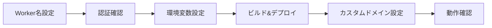

# Cloudflare Workers 本番環境デプロイ完全ガイド

> **対象プロジェクト**: Next.js 15 ボイラープレート
> **デプロイ先**: Cloudflare Workers
> **ドメイン**: カスタムドメイン (例: nagai-shouten.com)
> **最終更新**: 2026-01-08

## 📋 目次

1. [概要](#概要)
2. [前提条件](#前提条件)
3. [デプロイ手順](#デプロイ手順)
4. [カスタムドメイン設定](#カスタムドメイン設定)
5. [動作確認](#動作確認)
6. [トラブルシューティング](#トラブルシューティング)
7. [補足情報](#補足情報)

---

## 概要

このガイドでは、Next.js 15 プロジェクトを Cloudflare Workers に本番デプロイし、カスタムドメインを設定する手順を説明します。

### デプロイフロー



---

## 前提条件

### 必須要件

- [x] Cloudflare アカウント作成済み
- [x] Cloudflare Registrar でドメイン取得済み（またはドメイン移管済み）
- [x] Node.js 18.x 以上インストール済み
- [x] プロジェクトに `@opennextjs/cloudflare` 設定済み

### 確認事項

```bash
# Node.js バージョン確認
node -v
# v18.x 以上であること

# wrangler インストール確認
wrangler --version
# v4.x 以上であること

# プロジェクトディレクトリで実行
ls wrangler.toml open-next.config.ts
# 両ファイルが存在すること
```

---

## デプロイ手順

### Step 1: Worker 名の設定

プロジェクトの Worker 名をカスタマイズします。

**ファイル**: `wrangler.toml`

```diff
- name = "nextjs-boilerplate"
+ name = "nagai-shouten"
```

> **💡 Tips**: Worker 名はドメイン名と合わせると管理しやすいです。

---

### Step 2: 認証確認

Cloudflare CLI の認証状態を確認します。

```bash
wrangler whoami
```

#### 出力例（認証済み）

```
👋 You are logged in with an User API Token, associated with the email you@example.com.
┌───────────────────┬──────────────────────────────────┐
│ Account Name      │ Account ID                       │
├───────────────────┼──────────────────────────────────┤
│ nagai-shouten.com │ 20d0f1d15393a71d8e2d2a056c2d294d │
└───────────────────┴──────────────────────────────────┘
```

#### 未認証の場合

```bash
wrangler login
```

ブラウザが開き、Cloudflare にログインします。認証完了後、ターミナルに戻ります。

---

### Step 3: 環境変数の設定

Auth.js (NextAuth) で使用する秘密鍵を設定します。

#### 3.1 AUTH_SECRET の生成

```bash
openssl rand -base64 32
```

**出力例**:
```
Ykxr2T27E6r/JNvstjJIL7mCylzUw+aBd/mdnAnRMqo=
```

> **⚠️ 重要**: この値は一度しか表示されません。必ずメモしてください。

#### 3.2 Cloudflare Workers に秘密鍵を設定

```bash
# AUTH_SECRET を本番環境に設定
wrangler secret put AUTH_SECRET --env production
```

プロンプトが表示されたら、生成した値を貼り付けます：

```
Enter a secret value: › Ykxr2T27E6r/JNvstjJIL7mCylzUw+aBd/mdnAnRMqo=
✨ Success! Uploaded secret AUTH_SECRET
```

#### 3.3 AUTH_URL の設定

```bash
# AUTH_URL を本番環境に設定
wrangler secret put AUTH_URL --env production
```

プロンプトが表示されたら、カスタムドメインの URL を入力します：

```
Enter a secret value: › https://nagai-shouten.com
✨ Success! Uploaded secret AUTH_URL
```

#### 3.4 設定確認

```bash
# 設定された環境変数を確認
wrangler secret list --env production
```

**出力例**:
```
[
  {
    "name": "AUTH_SECRET",
    "type": "secret_text"
  },
  {
    "name": "AUTH_URL",
    "type": "secret_text"
  }
]
```

---

### Step 4: ビルド & デプロイ

#### 4.1 初回デプロイ前のクリーンアップ

既存のビルド成果物がある場合は削除します：

```bash
# 既存の .open-next ディレクトリを削除
rm -rf .open-next .next
```

#### 4.2 デプロイ実行

```bash
npm run deploy:production
```

このコマンドは以下を順次実行します：

1. **`npm run build`**: Next.js プロジェクトをビルド
2. **`opennextjs-cloudflare build`**: Cloudflare Workers 用に変換
3. **`wrangler deploy --env production`**: Cloudflare Workers にデプロイ

#### 4.3 デプロイ出力例

```
✨ Build completed successfully
📦 Deploying to Cloudflare Workers...
✅ Total Upload: 2.2 MB / gzip: 482 KB
✨ Success! Published to https://nagai-shouten.nagai-shouten.workers.dev
```

> **⏱️ 所要時間**: 初回デプロイは 2〜5 分程度かかります。

---

## カスタムドメイン設定

Worker を独自ドメインで公開します。

### Step 5: Cloudflare Dashboard でドメイン追加

#### 5.1 Workers & Pages を開く

1. [Cloudflare Dashboard](https://dash.cloudflare.com) にアクセス
2. 左側メニューから **「Workers & Pages」** を選択
3. デプロイされた **`nagai-shouten`** Worker をクリック

#### 5.2 カスタムドメインを追加

1. **「設定」** タブをクリック
2. **「トリガー」** セクションまでスクロール
3. **「カスタムドメイン」** の **「カスタムドメインを追加」** をクリック


4. ドメイン入力欄に **`nagai-shouten.com`** を入力
5. **「ドメインを追加」** をクリック

#### 5.3 www サブドメインも追加（推奨）

同じ手順で **`www.nagai-shouten.com`** も追加します。

> **💡 Tips**: www ありと www なしの両方を設定すると、ユーザーがどちらでアクセスしても動作します。

#### 5.4 DNS 設定（自動）

Cloudflare Registrar または Cloudflare で管理しているドメインの場合、DNS レコードは **自動的に設定** されます。

以下のレコードが自動追加されます：

| Type | Name | Content | Proxy |
|------|------|---------|-------|
| CNAME | @ | nagai-shouten.nagai-shouten.workers.dev | Proxied (オレンジクラウド) |
| CNAME | www | nagai-shouten.nagai-shouten.workers.dev | Proxied (オレンジクラウド) |

---

## 動作確認

### Step 6: デプロイ確認

#### 6.1 HTTPS アクセス確認

```bash
# ヘッダー情報を取得
curl -I https://nagai-shouten.com
```

**正常な出力例**:
```
HTTP/2 200
date: Wed, 08 Jan 2026 12:00:00 GMT
content-type: text/html; charset=utf-8
server: cloudflare
cf-ray: 123456789abcdef-NRT
```

#### 6.2 ブラウザでアクセス

```bash
# macOS の場合
open https://nagai-shouten.com

# Linux の場合
xdg-open https://nagai-shouten.com

# Windows の場合
start https://nagai-shouten.com
```

#### 6.3 主要ページの確認

以下のページが正常に表示されることを確認：

- [x] トップページ: `https://nagai-shouten.com/`
- [x] サービスページ: `https://nagai-shouten.com/services`
- [x] お問い合わせ: `https://nagai-shouten.com/contact`
- [x] ログインページ: `https://nagai-shouten.com/login`

---

## トラブルシューティング

### よくある問題と解決方法

#### 問題 1: `ENOTEMPTY` エラー

**エラーメッセージ**:
```
Error: ENOTEMPTY, Directory not empty: .open-next
```

**原因**: 既存のビルド成果物が残っている

**解決方法**:
```bash
# ビルド成果物を削除
rm -rf .open-next .next

# 再度デプロイ
npm run deploy:production
```

---

#### 問題 2: 認証エラー

**エラーメッセージ**:
```
Error: Not logged in. Please run wrangler login
```

**解決方法**:
```bash
# 再認証
wrangler login

# 認証確認
wrangler whoami
```

---

#### 問題 3: ドメインが反映されない

**症状**: カスタムドメインを追加したが、アクセスできない

**原因**: DNS 伝播に時間がかかっている

**解決方法**:

1. **DNS 伝播を確認**:
   ```bash
   # nslookup でドメインを確認
   nslookup nagai-shouten.com
   ```

2. **待機**: 通常は数分〜15分で反映されます（最大48時間）

3. **キャッシュクリア**:
   ```bash
   # DNS キャッシュをクリア（macOS）
   sudo dscacheutil -flushcache; sudo killall -HUP mDNSResponder

   # DNS キャッシュをクリア（Windows）
   ipconfig /flushdns
   ```

---

#### 問題 4: 環境変数が反映されない

**症状**: `AUTH_SECRET` などの環境変数が機能しない

**確認方法**:
```bash
# 設定済み環境変数を確認
wrangler secret list --env production
```

**解決方法**:
```bash
# 環境変数を再設定
wrangler secret put AUTH_SECRET --env production
wrangler secret put AUTH_URL --env production

# 再デプロイ
npm run deploy:production
```

---

#### 問題 5: ビルドエラー

**エラーメッセージ**:
```
Error: Build failed
```

**確認方法**:
```bash
# ローカルでビルドが成功するか確認
npm run build

# 型チェック
npm run lint
```

**解決方法**:
1. エラーメッセージを確認
2. TypeScript エラーを修正
3. 依存関係を確認: `npm install`
4. 再度デプロイ

---

## 補足情報

### テストユーザーの無効化（推奨）

本番環境では、開発用テストユーザーを無効化することを推奨します。

**ファイル**: `src/lib/auth/test-data.ts`

```typescript
// 本番環境では空配列を返す
export const TEST_USERS =
	process.env.NODE_ENV === "production" ? [] : [
		{
			id: "1",
			email: "user@example.com",
			// ...
		},
	];
```

### パフォーマンス最適化

デプロイ後、以下を確認：

1. **Lighthouse スコア**:
   - Chrome DevTools で Performance を測定
   - 目標: Performance 90 以上

2. **Core Web Vitals**:
   - LCP (Largest Contentful Paint): < 2.5s
   - FID (First Input Delay): < 100ms
   - CLS (Cumulative Layout Shift): < 0.1

### セキュリティチェックリスト

- [x] AUTH_SECRET が本番用に生成されている
- [x] テストユーザーが無効化されている
- [x] HTTPS が有効（Cloudflare 自動）
- [x] CSP ヘッダーが設定されている（middleware で実装済み）

### コスト見積もり

Cloudflare Workers の料金（2026年1月現在）:

- **Free プラン**: 100,000 リクエスト/日（無料）
- **Paid プラン**: $5/月 + $0.50/百万リクエスト

> **💰 Tips**: 個人サイトや小規模ビジネスなら Free プランで十分です。

---

## 参考リンク

- [Cloudflare Workers 公式ドキュメント](https://developers.cloudflare.com/workers/)
- [OpenNext Cloudflare アダプター](https://opennext.js.org/cloudflare)
- [Next.js 15 デプロイガイド](https://nextjs.org/docs/app/building-your-application/deploying)
- [Wrangler CLI リファレンス](https://developers.cloudflare.com/workers/wrangler/)

---

## まとめ

このガイドに従うことで、Next.js 15 プロジェクトを Cloudflare Workers に本番デプロイし、カスタムドメインで公開できます。

### デプロイ完了チェックリスト

- [x] Worker 名を設定
- [x] wrangler 認証完了
- [x] AUTH_SECRET と AUTH_URL を設定
- [x] ビルド & デプロイ成功
- [x] カスタムドメイン追加
- [x] HTTPS アクセス確認
- [x] 主要ページの動作確認
- [x] テストユーザー無効化（推奨）

---

**更新履歴**:
- 2026-01-08: 初版作成（デプロイ手順完全ガイド）
