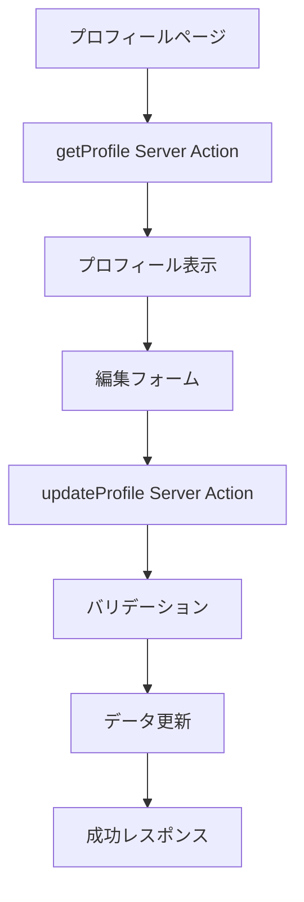

# プロフィール管理機能 - マニュアル & 仕様

## 📋 目次

- [機能概要](#機能概要)
- [ユーザー向け操作ガイド](#ユーザー向け操作ガイド)
- [開発者向け技術仕様](#開発者向け技術仕様)
- [セキュリティ仕様](#セキュリティ仕様)
- [アクセシビリティ仕様](#アクセシビリティ仕様)
- [API仕様](#api仕様)
- [トラブルシューティング](#トラブルシューティング)

## 🎯 機能概要

### 主要機能一覧

| 機能カテゴリ | 機能名 | 説明 |
|------------|--------|------|
| **プロフィール表示** | 概要表示 | 現在のプロフィール情報の表示 |
| **基本情報編集** | 個人情報管理 | 名前、表示名、自己紹介、所在地、ウェブサイト |
| **画像管理** | プロフィール画像 | アップロード・表示（JPEG/PNG/WebP、5MB制限） |
| **プライバシー** | 公開設定 | メール公開、プロフィール公開の制御 |
| **アカウント管理** | メール変更 | 確認メール送信による安全な変更 |
| **危険操作** | アカウント削除 | 確認テキスト入力による完全削除 |

### アクセス方法

- **URL**: `/profile`
- **認証**: ログイン必須
- **ナビゲーション**: サイドバー「プロフィール」、ユーザーメニュー

---

## 👤 ユーザー向け操作ガイド

### 1. プロフィール基本情報の編集

#### 必須項目
- **名前**: 他のユーザーに表示される名前（1-50文字、HTMLタグ不可）

#### 任意項目
- **表示名**: 名前とは別の表示名（1-50文字）
- **自己紹介**: プロフィール説明（500文字以内）
- **所在地**: 居住地域（100文字以内）
- **ウェブサイト**: 個人サイトやブログのURL（http://またはhttps://）

#### 操作手順
1. `/profile`にアクセス
2. 「基本情報」セクションでフィールドを編集
3. 「プロフィールを更新」ボタンをクリック
4. 成功メッセージを確認

### 2. プロフィール画像の設定

#### 対応形式・制限
- **形式**: JPEG、PNG、WebP
- **サイズ制限**: 5MB以下
- **推奨サイズ**: 正方形（例: 400x400px）

#### 操作手順
1. 「プロフィール画像」セクションで「画像を選択」をクリック
2. ファイルを選択（制限内のファイル）
3. アップロード完了を待つ
4. プレビューで確認

### 3. プライバシー設定

#### 設定項目
- **メールアドレスを公開する**: 他のユーザーにメールアドレスを表示
- **プロフィールを公開する**: プロフィール全体の公開・非公開

#### 操作手順
1. 「プライバシー設定」セクションでチェックボックスを操作
2. 「プロフィールを更新」で設定保存

### 4. メールアドレス変更

#### 操作手順
1. 「危険操作」セクションで「メールアドレスを変更」をクリック
2. 新しいメールアドレスを入力
3. 「確認メールを送信」をクリック
4. 受信した確認メールのリンクから変更完了

### 5. アカウント削除

⚠️ **この操作は取り返しがつきません**

#### 操作手順
1. 「危険操作」セクションで「アカウントを削除」をクリック
2. 確認テキスト「プロフィールを削除します」を正確に入力
3. 「削除を実行」をクリック
4. 自動的にログアウトしてホームページにリダイレクト

---

## 🔧 開発者向け技術仕様

### アーキテクチャ

```
/profile (Server Component)
├── ProfileEditForm (Client Component)
├── ProfileDangerZone (Client Component)
└── プロフィール概要表示 (Server Component)
```

### ファイル構成

```
src/
├── app/(app)/profile/
│   └── page.tsx                    # メインページ（Server Component）
├── components/profile/
│   ├── profile-edit-form.tsx       # 編集フォーム（Client Component）
│   └── profile-danger-zone.tsx     # 危険操作（Client Component）
├── app/actions/
│   └── profile.ts                  # Server Actions
├── lib/validation/
│   └── profile-schema.ts           # Zodバリデーションスキーマ
└── lib/auth/
    └── types.ts                    # TypeScript型定義
```

### 主要コンポーネント

#### 1. プロフィールページ (`page.tsx`)
- **種類**: Server Component
- **認証**: `auth()`による認証チェック
- **データ取得**: `getProfile()` Server Action
- **レンダリング**: SSR（Server-Side Rendering）

#### 2. プロフィール編集フォーム (`ProfileEditForm`)
- **種類**: Client Component
- **フォーム管理**: React Hook Form + Zod
- **送信処理**: `useFormSubmission` hook
- **画像アップロード**: FormData + `uploadProfileImage`

#### 3. 危険操作ゾーン (`ProfileDangerZone`)
- **種類**: Client Component
- **操作**: メール変更、アカウント削除
- **確認機能**: ダイアログ + 確認テキスト

### データフロー



---

## 🔒 セキュリティ仕様

### 1. 認証・認可

```typescript
// 全てのプロフィール操作で認証チェック
const session = await auth();
if (!session?.user?.id) {
    throw new ActionError("認証が必要です", "AUTHENTICATION_ERROR");
}
```

### 2. CSRF保護
- **実装**: Next.js 15組み込みCSRF保護
- **対象**: 全てのServer Actions
- **検証**: Origin/Refererヘッダーチェック

### 3. XSS防止

```typescript
// HTMLタグの検出と除去
const hasHtmlTags = /<[^>]*>/g.test(input);
if (hasHtmlTags) {
    throw new ValidationError("HTMLタグを含めることはできません");
}
```

### 4. 入力検証

| フィールド | バリデーション | 制限 |
|-----------|---------------|------|
| 名前 | 必須、長さ、HTMLタグ除去 | 1-50文字 |
| 表示名 | 長さ、HTMLタグ除去 | 1-50文字 |
| 自己紹介 | 長さ、HTMLタグ除去 | 500文字以内 |
| 所在地 | 長さ、HTMLタグ除去 | 100文字以内 |
| ウェブサイト | URL形式、プロトコル制限 | HTTP/HTTPS のみ |

### 5. ファイルアップロード安全性

```typescript
// ファイル形式とサイズチェック
const allowedTypes = ["image/jpeg", "image/png", "image/webp"];
const maxSize = 5 * 1024 * 1024; // 5MB

if (!allowedTypes.includes(file.type)) {
    throw new ValidationError("対応していないファイル形式");
}
```

---

## ♿ アクセシビリティ仕様

### WCAG 2.1 AA準拠

#### 1. セマンティックHTML
- `<form>` 要素による適切な構造
- `<fieldset>` と `<legend>` でグループ化
- `<section>` と `aria-labelledby` で領域分割

#### 2. ARIA属性

```html
<!-- エラー表示 -->
<div role="alert" aria-live="polite">エラーメッセージ</div>

<!-- フォーム説明 -->
<input aria-describedby="field-description" />
<p id="field-description">フィールドの説明</p>

<!-- 必須項目表示 -->
<label>名前 <abbr title="必須">*</abbr></label>
```

#### 3. キーボードナビゲーション
- **Tab順序**: 論理的な順序で操作可能
- **Enter/Space**: ボタン操作対応
- **Escape**: ダイアログ閉じる

#### 4. スクリーンリーダー対応
- **ラベル**: 全入力フィールドに適切なラベル
- **状態通知**: 送信中・完了・エラーを音声で通知
- **構造認識**: 見出しレベル（h1-h3）で階層構造

#### 5. 色覚対応
- **エラー表示**: 色だけでなくアイコンとテキストで表現
- **必須項目**: アスタリスク（*）マークで明示
- **コントラスト**: WCAG AA基準（4.5:1以上）

---

## 📡 API仕様

### Server Actions一覧

#### 1. `getProfile()`
```typescript
// 機能: プロフィール情報取得
// 認証: 必須
// 戻り値: ActionResult<{ profile: UserProfile }>

await getProfile();
```

#### 2. `updateProfile(data)`
```typescript
// 機能: プロフィール情報更新
// 認証: 必須
// 引数: ProfileUpdateFormValues
// 戻り値: ActionResult<{ message: string; profile: UserProfile }>

await updateProfile({
    name: "田中太郎",
    displayName: "タナカ",
    bio: "エンジニアです",
    location: "東京都",
    website: "https://example.com",
    emailVisible: false,
    profileVisible: true
});
```

#### 3. `uploadProfileImage(formData)`
```typescript
// 機能: プロフィール画像アップロード
// 認証: 必須
// 引数: FormData（imageフィールド）
// 戻り値: ActionResult<{ message: string; imageUrl: string }>

const formData = new FormData();
formData.append("image", file);
await uploadProfileImage(formData);
```

#### 4. `requestEmailChange(newEmail)`
```typescript
// 機能: メールアドレス変更要求
// 認証: 必須
// 引数: string（新しいメールアドレス）
// 戻り値: ActionResult<{ message: string }>

await requestEmailChange("new@example.com");
```

#### 5. `deleteProfile(data)`
```typescript
// 機能: プロフィール削除
// 認証: 必須
// 引数: { confirmText: string }
// 戻り値: ActionResult<{ message: string }>

await deleteProfile({
    confirmText: "プロフィールを削除します"
});
```

### レスポンス形式

```typescript
// 成功レスポンス
interface ActionSuccessResult<T> {
    success: true;
    data?: T;
    error?: never;
}

// エラーレスポンス
interface ActionErrorResult {
    success: false;
    data?: never;
    error: {
        message: string;
        code?: string;
        details?: {
            fieldErrors?: Record<string, string>;
        };
    };
}
```

---

## 🛠️ トラブルシューティング

### よくある問題と解決方法

#### 1. プロフィール画像がアップロードできない

**症状**: 「画像を選択」後にエラーが発生する

**原因と解決方法**:
- ファイルサイズ > 5MB → ファイルサイズを縮小
- 対応外形式（GIF、BMPなど） → JPEG/PNG/WebPに変換
- ネットワークエラー → 接続確認、再試行

**確認方法**:
```javascript
// ブラウザ開発者ツールで確認
console.log("ファイルサイズ:", file.size);
console.log("ファイル形式:", file.type);
```

#### 2. フォーム送信時のバリデーションエラー

**症状**: 「HTMLタグを含めることはできません」エラー

**原因**: `<`, `>`, `&` などの文字が含まれている

**解決方法**: 
- HTMLタグを使用しない
- 特殊文字を避ける
- プレーンテキストで入力

#### 3. メールアドレス変更の確認メールが届かない

**原因と解決方法**:
- 迷惑メールフォルダを確認
- メールアドレスの入力ミス → 正しいアドレスで再送信
- メールサーバーの遅延 → 時間をおいて確認

#### 4. アカウント削除ができない

**症状**: 「正確な確認テキストを入力してください」エラー

**解決方法**: 
- 「プロフィールを削除します」を正確に入力（ひらがな、漢字、句読点を含む）
- コピー&ペースト推奨
- 前後の空白文字に注意

#### 5. ページ表示エラー

**症状**: プロフィールページにアクセスできない

**原因と解決方法**:
- 未ログイン → `/login`でログイン
- セッション切れ → 再ログイン
- ネットワークエラー → 接続確認

### 開発者向けデバッグ

#### 1. Server Actions のデバッグ

```typescript
// actions/profile.ts でログ確認
console.log("プロフィール更新:", {
    userId: session.user.id,
    data: sanitizedData,
});
```

#### 2. フロントエンドエラー確認

```typescript
// useFormSubmission でエラー確認
const { submitError, submitStatus } = useFormSubmission({...});
console.log("送信エラー:", submitError);
console.log("送信状態:", submitStatus);
```

#### 3. アクセシビリティ確認

```javascript
// 開発者ツールでアクセシビリティ監査
// Lighthouse > Accessibility タブ
// axe DevTools 拡張機能使用
```

---

## 📚 参考情報

### 関連ファイル
- **型定義**: `src/lib/auth/types.ts`
- **バリデーション**: `src/lib/validation/profile-schema.ts`
- **共通フック**: `src/hooks/use-form-submission.ts`
- **アクセシビリティ**: `src/components/accessibility/`

### 技術スタック
- **Framework**: Next.js 15.4.6 (App Router)
- **React**: 19.1.0 (React Compiler有効)
- **認証**: Auth.js v5 (JWT戦略)
- **バリデーション**: Zod
- **フォーム**: React Hook Form
- **スタイリング**: Tailwind CSS v4
- **アクセシビリティ**: WCAG 2.1 AA準拠

### 更新履歴
- **v1.0.0** (2025-01-14): 初版リリース
  - プロフィール編集機能実装
  - WCAG 2.1 AA準拠
  - Server First原則適用
  - セキュリティ対策完備

---

*このマニュアルに関する質問や改善提案がありましたら、開発チームまでお知らせください。*