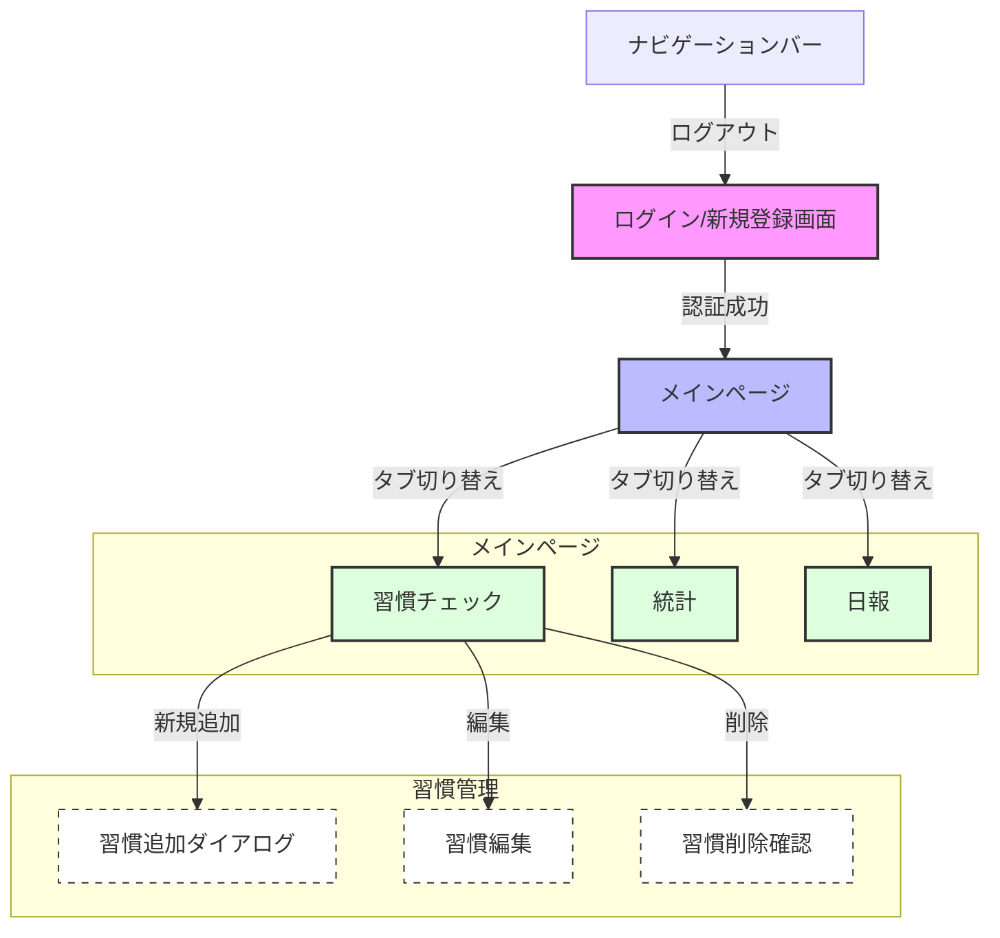

# 画面遷移図

## 画面詳細

### 1. ログイン/新規登録画面 (`/auth`)

- ユーザー名とパスワードによる認証
- 新規登録/ログイン切り替え
- 認証成功後はメインページへリダイレクト

### 2. メインページ (`/`)

#### ナビゲーションバー

- ユーザー名表示
- ログアウトボタン

#### タブメニュー

1. **習慣チェック**
   - 週間カレンダービュー
   - 習慣の追加/編集/削除
   - チェックボックスによる達成記録
   - 達成時の絵文字表示

2. **統計**
   - 週間達成率グラフ
   - 習慣別達成率
   - 日別達成状況

3. **日報**
   - 日別の学習記録
   - メモ機能
   - 自動保存

### モーダル/ダイアログ

1. **習慣追加ダイアログ**
   - 習慣名入力
   - 追加確認

2. **習慣編集**
   - 習慣名変更
   - 保存確認

3. **習慣削除確認**
   - 削除確認メッセージ
   - 取り消し不可の警告

## レスポンシブ対応

- デスクトップ: テーブルビュー
- モバイル: グリッドビュー
- タッチ操作対応
