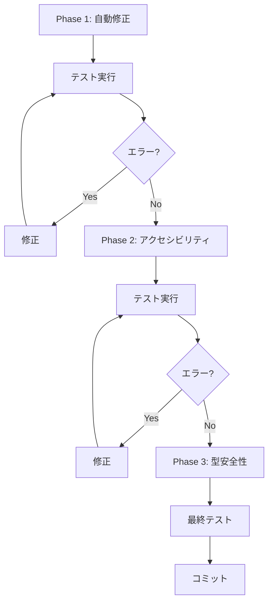

# 警告改善チェックリスト (2025-08-14 06:32)

## 概要
現在の状態: TypeScriptエラー 0件、Lintエラー 102件、警告 153件
目標: Lintエラーと警告を段階的に削減し、コード品質を向上

## Phase 1: 自動修正可能な項目 (予想時間: 30分)

### 1.1 インポート順序の整理
- **優先度**: High
- **対象**: `assist/source/organizeImports` エラー
- **完了条件**: 
  - [ ] Biomeの自動修正を全ファイルに適用
  - [ ] インポート順序エラー 0件
- **コマンド**: `npm run lint -- --write`
- **予想される問題点**: 
  - 大量のファイル変更により差分が見づらくなる
  - 一部のファイルで手動修正が必要な可能性

### 1.2 フォーマットの統一
- **優先度**: High  
- **対象**: フォーマット関連の警告
- **完了条件**:
  - [ ] Biomeフォーマッターを全ファイルに適用
  - [ ] フォーマットエラー 0件
- **コマンド**: `npm run format`
- **予想される問題点**:
  - 意図的なフォーマットが変更される可能性
  - コードレビューが必要

## Phase 2: アクセシビリティ改善 (予想時間: 1-2時間)

### 2.1 ARIA属性の修正
- **優先度**: Critical (WCAG 2.1 AA準拠のため)
- **対象**: `useAriaPropsSupportedByRole` エラー (~4件)
- **完了条件**:
  - [ ] span要素のaria-label属性を適切な要素に変更
  - [ ] 不適切なARIA属性の除去または修正
- **予想される問題点**:
  - UIの意図が変わる可能性
  - スクリーンリーダーのテストが必要

### 2.2 セマンティックHTML化  
- **優先度**: High
- **対象**: `useSemanticElements` エラー (~4件)
- **完了条件**:
  - [ ] role="status" → `<output>` 要素へ変更
  - [ ] role="region" → `<section>` 要素へ変更
- **予想される問題点**:
  - CSSスタイリングの調整が必要
  - コンポーネントのプロパティ変更

### 2.3 SVGアクセシビリティ
- **優先度**: Medium
- **対象**: `noSvgWithoutTitle` エラー (~1件)
- **完了条件**:
  - [ ] SVG要素に`<title>`要素を追加
  - [ ] または適切な`aria-label`を追加
- **予想される問題点**:
  - 重複するラベルの可能性

## Phase 3: 型安全性向上 (予想時間: 2-3時間)

### 3.1 暗黙的any型の解消
- **優先度**: High
- **対象**: `noExplicitAny`, `noImplicitAnyLet` エラー (~60件)
- **完了条件**:
  - [ ] テストファイルのモック関数に適切な型定義
  - [ ] 変数宣言に型注釈または初期値を追加
  - [ ] ジェネリック型パラメータの明示化
- **予想される問題点**:
  - 複雑な型定義が必要な場合がある
  - 既存の型定義との整合性確認

### 3.2 未使用パラメータの削除
- **優先度**: Medium  
- **対象**: `noUnusedFunctionParameters` エラー (~20件)
- **完了条件**:
  - [ ] 未使用パラメータの削除または`_`プレフィックス追加
  - [ ] 必要なパラメータの使用確認
- **予想される問題点**:
  - インターフェースの破壊的変更
  - 将来の拡張性への影響

### 3.3 パラメータ代入の解消
- **優先度**: Low
- **対象**: `noParameterAssign` エラー (~8件)
- **完了条件**:
  - [ ] forwardRefのref代入をローカル変数に変更
  - [ ] パラメータの直接変更を避ける
- **予想される問題点**:
  - React forwardRefパターンの特殊性

## Phase 4: その他の改善 (オプション)

### 4.1 配列インデックスキーの改善
- **優先度**: Low
- **対象**: `noArrayIndexKey` エラー
- **完了条件**:
  - [ ] 一意なキー値の使用
- **予想される問題点**:
  - パフォーマンスへの影響は限定的

### 4.2 制御文字の適切な処理
- **優先度**: Low
- **対象**: `noControlCharactersInRegex` エラー
- **完了条件**:
  - [ ] 正規表現の見直し
- **予想される問題点**:
  - セキュリティテストの意図を保持

## 実装順序と依存関係

## 成功基準

- **必須**:
  - ビルドエラー: 0件を維持
  - テスト: 全611件パスを維持
  - Critical優先度の警告: 0件

- **推奨**:
  - Lintエラー: 50件以下
  - 警告: 100件以下
  - 自動修正可能な項目: 0件

## リスク管理

1. **破壊的変更の回避**:
   - 各フェーズごとにgit stashまたはブランチ作成
   - テスト実行による動作確認
   
2. **時間管理**:
   - Phase 1-2を優先実施（高ROI）
   - Phase 3は部分的実施も可

3. **ロールバック計画**:
   - 各フェーズごとのコミット
   - 問題発生時は前のコミットに戻る